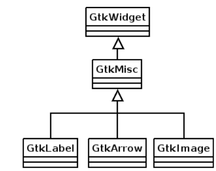
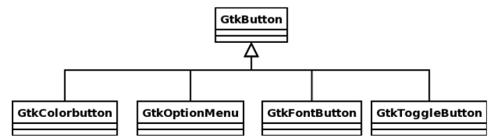
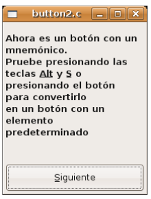
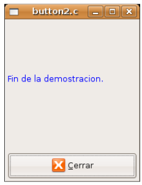
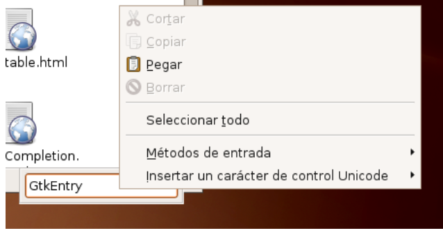

Introducción
------------

A continuación comenzaremos a estudiar la parte gráfica, de interacción con el usuario. Discutiremos el concepto genérico de widget y como utilizarlos para construir gran cantidad de objetos.

El concepto de widget
=====================

La palabra widget proviene de una contracción de la lengua inglesa: “Window Gadget6”, que se utiliza
para referir a los diferentes elementos de una interfaz gráfica de usuario. Un widget de GTK+ es un
componente de interfaz gráfica de usuario, es un objeto en toda la extensión de la palabra. Ejemplos de
widgets son las ventanas, casillas de verificación, botones y campos editables. Los widgets (no
importando de que tipo sean), siempre se definen como punteros a una estructura GtkWidget. Esta
estructura es un tipo de dato genérico utilizado por todos los widgets y ventanas en GTK+.

Figura 3.1.1: Diagrama UML de herencia de GObject

La librería GTK+ sigue un modelo de programación orientada a objetos(POO). La jerarquía de
objetos comienza en GObject de la librería Glib del que hereda GtkObject. Todos los widgets
heredan de la clase de objetos GtkWidget, que a su vez hereda directamente de GtkObject. Un
diagrama UML que muestra tales relaciones se muestra en la figura 3.1.1.

La clase GtkWidget contiene las propiedades comunes a todos los widgets; cada widget
particular le añade sus propias propiedades. En GTK+ los widgets presentan una relación padre/hijo
entre sí, las aplicaciones suelen tener un widget "ventana" de nivel superior que no tiene padre, pero
aparte de él, todos los widgets que se usen en una aplicación deberán tener un widget padre. Al widget
padre se le denomina contenedor

Nomenclatura GTK
================

Cualquier proyecto de software, por pequeño que sea, requiere una gran inversión en tiempo y trabajo.
Considerando que el software Libre como GTK+ o GNOME son proyectos enormes que no pueden ser
manejados por un grupo reducido de personas, ofrecer una nomenclatura consistente es de vital
importancia para poder coordinar los esfuerzos de miles de programadores alrededor del mundo.

Antes de continuar precisa discutir adecuadamente la nomenclatura de objetos, métodos y, en
general, el estilo de programación de GTK+, Glib, Gdk, GdkPixBuf, Gobject, etc.. Cubriendo
estos lineamientos tendremos el beneficio de mejorar nuestros hábitos de programación, escribiendo
código que puede ser entendido por cualquier otra persona.

Seremos capaces de acostumbrarnos rápidamente a gran cantidad de librerías que utilizan este
estilo de programación como el entorno de programación de GNOME.
Como extracto del documento “GNOME Programming Guidelines”[7] resumimos la
nomenclatura de GTK+. 

* Siempre que sea posible, en GTK+ siempre se debe evitar el uso de variables
  globales. Esto es importante aún más para librerías, ya que las variables
  globales dentro de sendos módulos se exportan junto a las funciones (métodos
  si consideramos a una librería como un objeto). Todos estos **símbolos** se
  integran al espacio global de nombres de la aplicación que llama a la
  librería(Global Namespace). Un variable global de una librería cuyo nombre
  haya sido asignado de manera descuidada puede causar conflictos con otra
  variable con el mismo nombre que se esté usando en una parte del código que
  utiliza la librería.

* Los nombres de las funciones deberán tener la forma
  modulo_submodulo_operacion(). Por ejemplo: gtk_window_new(),
  g_string_truncate() ó g_tree_destroy(). Esta simple nomenclatura evita el
  choque de **símbolos** o nombres entre diferentes módulos de las librerías.

* Los **símbolos** (funciones y variables), deberán tener nombres descriptivos:
  en lugar de usar cntusr() deberemos usar contar_usuarios_activos(). Esto hace
  que el código fuente sea fácil de usar y casi auto-documentado.
* Los nombres de funciones deben estar en minúsculas y deberán usar guión bajo
  para separar palabras, por ejemplo: g_string_destroy(), gtk_window_new(),
  abrir_puerto().

* Las macros y enumeraciones deben escribirse en letras mayúsculas, utilizando
  guiones bajos para separar palabras, por ejemplo: TRUE o G_DIR_SEPARATOR .
* Tipos de datos, objetos y nombres de estructuras son una mezcla entre
  mayúsculas y minúsculas, por ejemplo: Gslist, GtkWidget.

* El uso de guión bajo para separar palabras hace que el código fuente luzca
  menos apretado y fácil de editar ya que se pueden utilizar de mejor manera los
  comandos de navegación por palabras de los editores de texto de forma que
  naveguemos más rápidamente.

* A la hora de escribir una librería se hace común compartir **símbolos**
  (nombres de variables o funciones), entre los diversos componentes de la
  librería pero no se desea que estos símbolos estén disponibles para loss
  usuarios de la librería. En tal caso, se puede anteponer un guión bajo al
  nombre de la función o variable mientras éste sigue la nomenclatura
  modulo/submódulo descrita arriba. Por ejemplo: _modulo_objeto_algunmetodo().

Proceso de creación de un widget
================================

El proceso de creación de un **widget** consta de cuatro pasos:

(1) Creación de la instancia de clase del **widget** que deseamos utilizar.
(2) Configuración de esta instancia (tamaño, clase, relación con **widgets** padres, etc..)
(3) Conexión de señales y eventos.
(4) Visualización de la instancia.

De acuerdo a la nomenclatura de la sección anterior, si la clase de un *widget* es GtkClase, su
constructor de clase y todos los métodos asociados a esta tendrán la siguiente nomenclatura:
gtk_clase_metodo:

* "clase" debe sustituirse por el nombre del **widget** que se desea crear.
* "metodo" describe la acción que ejecutará la instancia de la clase. Por
  ejemplo, el constructor de clase GtkWindow tiene la siguiente nomenclatura:
  gtk_window_new().

La función de creación de un **widget** gtk_clase_new() siempre debe devolver un puntero (en
lenguaje C) a una instancia de tipo GtkWidget y no un puntero a una instancia del tipo creado. Por
ejemplo, la función gtk_window_new() devuelve un puntero a un objeto de GtkWidget y no una
instancia de tipo GtkWindow.

Es importante remarcar esta característica primordial de GTK+, ya que si recordamos que el
lenguaje C no es un lenguaje orientado a objetos, nosotros deberemos hacernos cargo del correcto
moldeo de tipos de clase.

La preferencia de los constructores de clase de regresar la referencia a un tipo de dato de la clase
base (GtkWidget) en lugar de regresar como un puntero a la clase heredada (GtkWindow) se
justifica gracias a que muchos métodos de la clase base aún aplican a la clase heredada. 
El mejor
ejemplo lo encontramos a la hora de hacer visible la instancia del objeto de tipo GtkWindow, para ello
se utiliza el método gtk_widget_show(). Si en algún momento se necesitase un puntero del tipo
de la clase heredada podemos hacer uso de las macros que define cada objeto de GTK+ y que nos
ayudan a moldear nuestro puntero a la clase de conveniencia.

Con nuestro ejemplo, si necesitásemos un puntero del tipo GtkWindow utilizando como base al
puntero de tipo GtkWidget, recurriríamos a la macro GTK_WINDOW. Ahora un mismo objeto se
puede comportar de dos formas distintas. Esto es conocido en cualquier lenguaje que soporte
programación orientada a objetos como **polimorfismo**.

Un ejemplo no compilable, pero ilustrativo, se redacta a continuación.
(Listado de programa 3.3.1)

.. code-block:: c

    /* Crear una ventana con GTK+ */
    /*Primero debemos incluir la librería gtk*/
    #include <gtk.h>
    main(){
    GtkWidget *ventana;
    ...
    /*Crear la instancia de clase GtkWindow*/
    ventana = gtk_window_new(...);
    60
    /*Cambiar el tamaño de la ventana, por ejemplo, para ocupar 
        toda la   pantalla del monitor
        Note que se utiliza la macro GTK_WINDOW que hace que el 
        objeto   ventana se comporte como GtkWindow.
    */
    gtk_window_set_full_screen(GTK_WINDOW(ventana));
    /*A continuación hacer visible el objeto gráfico 
        utilizando herencia y polimorfismo.
        Note que el objeto ventana ahora se comporta como GtkWidget.
    */
    gtk_widget_show(ventana);
    /*Otorgar control completo a la librería GTK+*/
    gtk_main();
    ....
    }

Es importante hacer notar que, en este ejemplo en específico, el objeto  ventana  es de tipo 
GtkWindow, pero a la vez es del tipo  GtkWidget. Como el tipo base del puntero ventana es 
GtkWidget, es necesario moldearlo al tipo GtkWindow para que pueda comportarse como éste tipo 
de objeto. Si no se hace esto, el compilador se quejará y la aplicación terminará con una violación de 
segmento.

El interfaz gráfico de una aplicación se construye combinando diferentes  widgets  (ventanas, 
cuadros combinados, cuadros de texto, botones, ...) y se establecen diversas retrollamadas (callbacks), 

(Figura 3.3.1: Ciclo de vida)

Es importante hacer notar que, en este ejemplo en específico, el objeto ventana es de tipo
GtkWindow, pero a la vez es del tipo GtkWidget. Como el tipo base del puntero ventana es
GtkWidget, es necesario moldearlo al tipo GtkWindow para que pueda comportarse como éste tipo
de objeto. Si no se hace esto, el compilador se quejará y la aplicación terminará con una violación de
segmento.

El interfaz gráfico de una aplicación se construye combinando diferentes *widgets* (ventanas,
cuadros combinados, cuadros de texto, botones, ...) y se establecen diversas retrollamadas (*callbacks*)
eventos asíncronos; de esta forma se obtiene la lógica requerida por el programa a medida que se
producen ciertas señales que a su vez provocan las *retrollamadas*.

Las señales se producen por diversos sucesos como oprimir el botón de un ratón
que se encuentra sobre un *widget* botón, pasar el cursor por encima de un
*widget* u oprimir una tecla

Teoría de señales y retrollamadas
=================================

GTK+ es una librería dirigida por eventos. Desde el punto de vista del programador esto significa que
se quedará en el bucle principal de ejecución ( gtk_main() ), hasta que algún evento o señal ocurra
y el control se pase a la función apropiada.

Las señales son el medio por el cual GTK+ informa a las aplicaciones de los acontecimientos
producidos en el interfaz gráfico o dentro de los objetos que componen el programa.

Las señales son importantes dentro de las aplicaciones con interfaz gráfica de usuario ya que el
programa debe responder a las acciones que el usuario ejecute que por naturaleza son asíncronas y no
se pueden predecir o prever.

Si el usuario mueve el ratón, presiona un botón, escribe un texto o cierra una ventana, una función
retrollamada se ejecuta y se realiza el cómputo requerido por el usuario, por ejemplo: guardar un
archivo.

Un procesador de textos puede tener un botón que haga que el bloque seleccionado de texto
adquiera los atributos de letra negrita. La **retrollamada** asignada a ese botón contiene el código que se
encargará de llevar a cabo esa tarea.

De alguna forma, antes de cerrar una aplicación se hace necesario llamar a rutinas de limpieza,
guardar el trabajo del usuario o simplemente desplegar un diálogo que pregunte si realmente desea
cerrar la ventana.

En una aplicación, como veremos más tarde, continuamente se están generando señales y eventos,
sin embargo no todos son atendidos y sólo conectamos **retrollamadas** para aquellos eventos o señales
que son de nuestro interés.

Cuando deseamos atender a la escucha de una señal o **retrollamada**, se asocia un *widget* y una
función en C. Así, también se puede asociar **retrollamadas** a más de un *widget* ahorrando código que
deba escribirse.

Rutinas de tratamiento de señales y eventos
===========================================

En GTK+ señales y eventos se administran casi de la misma manera, la distinción entre estos dos
grupos se debe a que las señales son provocadas por el sistema de objetos de Glib / GTK+ y los
eventos son una corriente de mensajes que llegan desde el subsistema gráfico. Desde una perspectiva
del programador resulta sencillo pensar en los eventos como cualquier señal causada por la interacción
del usuario con el programa.

Dos de las señales básicas en GTK+ son delete_event y destroy. El evento
delete_event generalmente se envía a una ventana cuando el usuario trata de cerrarla. Por su parte,
la señal destroy se manda a un objeto cuando su método de destrucción debe ser invocado.
Una ventana de nivel superior siempre debe conectar una función **retrollamada** al evento
delete_event. Si el usuario quiere cerrar la ventana, entonces la aplicación deberá terminar
correctamente.

Una retrollamada es una función en C como cualquier otra. Sin embargo, dependiendo de la señal
o evento a escuchar es como se declarará el tipo dato de regreso y los parámetros. Una vez escrita
adecuadamente, se registra esta rutina ante GTK+ usando la macro g_signal_connect().

.. code-block:: c

    #define g_signal_connect(instance, detailed_signal, c_handler, data)

**Descripción****: Conecta una función retrollamada que atenderá una señal de un objeto en particular.

**Parámetros**:

* **instance** : Es la referencia al *widget* u objeto del que queremos escuchar
  señales y eventos. Este puntero debe estar moldeado al tipo GObject ya que
  GtkWidget está es un derivado de éste. Para esto deberemos usar la macro
  G_OBJECT().

* **detailed_signal** : Es una cadena que especifica la señal o evento a escuchar.

* **c_handler** : El puntero de la función *retrollamada*. Este puntero debe
  estar moldeado mediante la macro G_CALLBACK() al tipo de puntero GCallback. El
  prototipo de cada función *retrollamada* se determina por el contexto en el
  que será usada; visto de otra manera: el prototipo de cada función se
  determina por el tipo de señal a la que será conectada.

* **data** : Este último argumento permite adjuntar algún dato extra a la
  *retrollamada*, de tal manera que se evite el uso de variables globales y en
  su lugar se pasen estructuras o valores directamente a la función
  *retrollamada* cuando ésta sea invocada.

La función retrollamada cambia dependiendo de la señal que se desea escuchar, pero hay una
función retrollamada prototipo que se usa como base para todas las demás:

.. code-block:: c

    void (*Gcallback) (void);

Lo anterior no significa que todas las funciones retrollamadas no deban tomar parámetros y
regresar void.

Una función **retrollamada** muy común en GTK+ y puede tener el siguiente prototipo:

.. code-block:: c

    void funcion_retrollamada ( Gtkwidget *widget,
    gpointer datos);

El primer argumento es un puntero al widget que recibe el evento o genera la señal.
El segundo argumento es un puntero a los datos extras que se mandaron cuando se conectó la
señal a la retro llamada. De nuevo hay que hacer notar que el perfil de retro llamada descrito arriba es
sólo una forma general. Hay algunas retrollamadas generadas por widgets especiales que requieren
diferentes parámetros.

Eventos
=======

En complemento al mecanismo de señales descrito arriba, hay un conjunto de eventos que reflejan el
mecanismo de eventos del subsistema gráfico del sistema operativo (En UNIX será X-window). Las
funciones retrollamada también se pueden conectar a estos. Son

* event
* button_press_event
* button_release_event
* scroll_event
* motion_notify_event
* delete_event
* destroy_event
* expose_event
* key_press_event
* key_release_event
* enter_notify_event
* leave_notify_event
* configure_event
* focus_in_event
* focus_out_event
* map_event
* unmap_event
* property_notify_event
* selection_clear_event
* selection_request_event
* selection_notify_event
* proximity_in_event
* proximity_ouLevent
* visibility_notify_event
* client_event
* no_expose_event
* window_state_event

Para poder conectar una función retro llamada a alguno de estos eventos, se usará la función
g_signal_connect() , tal y como se ha descrito arriba usando alguno de los nombres que se dan
como el parámetro señal. La función retro llamada para eventos es un poco diferente a la que se usa
para las señales:

.. code-block:: c

    gint funcion_retrollamada( GtkWidget *widget,
    GdkEvent *event,
    gpointer datos_extra );

En C, GdkEvent es una unión, de la cual su tipo dependerá de cual de los eventos mostrados
arriba se han producido y esta construido mediante diferentes máscaras de eventos.. Para poder
decirnos que tipo de evento ha ocurrido, cada una de las posibles alternativas tiene un miembro type que muestra que evento ocurrió. Los otros elementos de la estructura dependerán de que tipo de evento
se generó. Las máscaras de los tipos posibles de eventos son:

.. code-block:: c

    GDK_NOTHING
    GDK_DELETE
    GDK_DESTROY
    GDK_EXPOSE
    GDK_MOTION_NOTIFY
    GDK_BUTTON_PRESS
    GDK_2BUTTON_PRESS
    GDK_3BUTTON_PRESS
    GDK_BUTTON_RELEASE
    GDK_KEY_PRESS
    GDK_KEY_RELEASE
    GDK_ENTER_NOTIFY
    GDK_LEAVE_NOTIFY
    GDK_FOCUS_CHANGE
    GDK_CONFIGURE
    GDK_MAP
    GDK_UNMAP
    GDK_PROPERTY_NOTIFY
    GDK_SELECION_REQUEST
    GDK_SELECTION_NOTIFY
    GDK_PROXIMITY_IN
    GDK_PROXIMITY_OUT
    GDK_DRAG_ENTER
    GDK_DRAG_LEAVE
    GDK_DRAG_MOTION
    GDK_DRAG_STATUS
    GDK_DROP_START
    GDK_DROP_FINISHED
    GDK_CLIENTE_EVENT
    GDK_VISIBILITY_NOTIFY
    GDK_NO_EXPOSE
    GDK_SCROLL
    GDK_WINDOW_STATE
    GDK_SETTING

.. code-block:: c

En resumen: para conectar una retro llamada a uno de esos eventos, usaremos algo como lo que se
presenta:

.. code-block:: c

    g_signal_connect ( G_OBJECT (button),
    "button_press_event",
    G_CALLBACK (button_press_callback),
    NULL);

Si asumimos que button es un *widget*. Cuando el ratón esté sobre el botón y el botón sea
presionado, se llamará a la función button_press_callback(), la cual puede ser declarada
como sigue:

.. code-block:: c

    static gint button_press_callback( GtkWidget *widget,
    GdkEventButton *event,
    gpointer data );

Es preciso hacer notar que el segundo argumento lo podemos declarar como tipo
GdkEventButton por que ya sabemos cuál es el evento que ocurrirá para que esta función sea
invocada. El valor regresado por esta función indica si el evento se deberá propagar más allá por el
mecanismo de manejo de señales de GTK+. Regresar FALSE indica que el evento ya ha sido tratado
correctamente y ya no se debe propagar.

Bucle de ejecución y eventos
============================

El bucle de eventos de GTK+ es el responsable de que el sistema de señales funcione correctamente, ya
que el primero no es más que un bucle interno de GTK+, en el que se van, una y otra vez, comprobando os estados de cada uno de los elementos de la aplicación, e informando de dichos cambios a los
elementos que se hayan registrado para ser informados. Este bucle de eventos GTK+ se traduce
básicamente en dos funciones, que son gtk_main() y gtk_main_quit().

gtk_main() entrega el control de cualquier programa al bucle de eventos de GTK+. Esto
significa que, una vez que se haya realizado la llamada a gtk_main(), se cede todo el control de la
aplicación a GTK+. Aunque gtk_main() toma el control de la aplicación, es posible ejecutar otras
porciones de código aprovechando el sistema se señales usando algún manejador (instalado ANTES de
llamar a gtk_main())
Dentro de algún manejador o *retrollamada* se puede llamar a gtk_main_quit() que termina
el bucle de eventos de GTK+. El pseudo-código de una típica aplicación GTK+ seria:

.. code-block:: c

    int main (int argc, char *argv[])
    {
    gtk_init (&argc, &argv);
    /* creación del interfaz principal */
    /* conexión a las distintas señales */
    gtk_main ();
    return 0;
    }

Como puede comprobarse, el programa inicializa GTK+, crea el interfaz básico, conecta funciones
a las distintas señales en las que esté interesado (llamadas a g_signal_connect()), para
seguidamente entregar el control del programa a GTK+ mediante gtk_main().
Cuando en algún manejador de señal realicemos una llamada a gtk_main_quit(),
gtk_main() retornará, tras lo cual la aplicación termina.

Ejemplo
=======

A continuación se mostrará un sencillo ejemplo mostrando el proceso de creación del widget más
sencillo (GtkWindow) y el uso de señales.

Comencemos recordando el capítulo 3.3. El primer *widget* que aprenderemos a usar es
GtkWindow que es ventana común y corriente

(Listado de programa 3.4.1) 

.. code-block:: c

    /***************************************************************************
    * Programacion de interfases graficas de usuario con GTK
    *  
    *  Nombre de archivo:      bucle1.c
    * Descripcion:            Crea una ventana.
    * Widgets usados:         GtkWindow
    *  Comentarios:            
    *   
    *  TESIS PROFESIONAL       INSTITUTO TECNOLOGICO DE PUEBLA
    *                          INGENIERIA ELECTRONICA
    *  Autor: Noe Misael Nieto Arroyo tzicatl@gmail.com
    *
    ****************************************************************************/
    #include <gtk/gtk.h>
    int main( int   argc, char *argv[] )
    {
    GtkWidget *window;
    
    
    /* Inicializar la libreria GTK */
    gtk_init (&argc, &argv);
    /*Crea una nueva instancia de GtkWindow*/
    window = gtk_window_new(GTK_WINDOW_TOPLEVEL);
    /*Configura la instancia de GtkWindow*/
    gtk_window_set_title (GTK_WINDOW (window), "bucle1.c");
    gtk_widget_set_size_request(window,200,100);
    /*Conectar señales.
    Cuando la señal "destroy" se emita, se llamará a la 
    función gtk_main_quit() que termina el programa
    */
    g_signal_connect (G_OBJECT (window), "destroy",
        G_CALLBACK (gtk_main_quit),
        NULL);
    /*Muestra la ventana en la pantalla*/

    gtk_widget_show (window);
    /*Cede el control de la apliación a GTK+*/
    gtk_main ();
    
    return 0;
    }

El primer paso es inicializar la librería GTK+ con esta instrucción:

.. code-block:: c

    gtk_init (&argc, &argv);

De no incluirla, nuestros programas fallarían de manera inmediata.
El siguiente paso es crear una instancia de una ventana y alojar la referencia al objeto en la
variable window:

.. code-block:: c

    window = gtk_window_new(GTK_WINDOW_TOPLEVEL);

El constructor de clase de GtkWindow toma un parámetro, es el tipo de ventana que se desea
crear. Las ventanas normales, como la ventana del navegador (Firefox ó Mozilla) o el administrador de
archivos (Nautilus) son ventanas de nivel superior (GTK_WINDOW_TOPLEVEL).
El siguiente paso en nuestra aplicación es establecer el título ...

.. code-block:: c

    gtk_window_set_title (GTK_WINDOW (window), "bucle1.c"); 

... y el tamaño:

.. code-block:: c

    gtk_widget_set_size_request(window,200,100); 

Observe que el método utilizado para cambiar el tamaño de la ventana es un método de
GtkWidget y no de GtkWindow.

Observe también que al establecer el título de la ventana se utilizó una especie de macro con el
puntero window como parámetro. ¿Por qué ocurre esto?
El constructor de GtkWindow regresa la instancia de GtkWindow como un puntero de
GtkWidget y no de GtkWindow. Esto es necesario para que se pueda utilizar el polimorfismo en el lenguaje C. Usando punteros al objeto más general como GtkWidget nos permite moldearlo a
cualquier otro objeto derivado.

El método gtk_window_set_title() requiere que el primer parámetro sea un puntero de
tipo GtkWindow; la macro GTK_WINDOW() moldea el puntero de tipo GtkWidget a puntero
GtkWindow.

El método gtk_widget_set_size_request() requiere que el primer parámetro sea un
puntero de tipo GtkWindow; en el caso citado anteriormente no es necesario moldear el puntero
window pues ya es del tipo deseado.

¿Que ocurriría si decido no usar las macros de moldaje de tipos? El compilador se quejaría de
punteros de tipos incompatibles.

A continuación viene la instrucción más importante del programa:

.. code-block:: c

    g_signal_connect (G_OBJECT (window), "destroy",
    G_CALLBACK (gtk_main_quit),
    NULL);

El prototipo de la macro g_signal_connect() es ya conocida desde el capítulo 3.4.1. El
objeto window conectará la señal "destroy" a la función gtk_main_quit(). La señal
"destroy" se emite cuando la ventana es cerrada.

Cuando el usuario cierre la ventana también ocasionará que el bucle de control de Gtk+ termine y
con ello la aplicación.

¿Qué ocurriría si no conectáramos esta señal? Al cerrar la ventana, esta desaparecería pero el
programa seguiría ejecutándose en memoria.

Por último hacemos visible la ventana y entregamos el control de la aplicación al bucle de GTK+.

Los frutos de nuestro programa se muestran en la Figura 3.4.1.

Widgets contenedores
====================

Uno de los conceptos fundamentales de Gtk+ son los contenedores. Un widget contenedor es aquel
que es capaz de contener a otros **widgets**. Existen una gran cantidad de contenedores y GTK+ los
utiliza para acomodar los **widgets** dentro de la interfaz gráfica de usuario..

Cuando se escribe una aplicación, normalmente se necesita colocar mas de un widget dentro de
una ventana. En el ejemplo anterior(listado de programa 3.4.1) no necesitamos de ningún otro widget
más que la ventana.

El ejemplo anterior no ofrece utilidad más allá de la didáctica, pero como no conocemos aún
ningún otro widget lo tomaremos como base para extender nuestra aplicación.
El diagrama de herencia de clase de GtkWindow es el siguiente.

  

Como podemos ver en la Figura 3.5.1 GtkWindow también puede contener otros **widgets**, pues
desciende de la clase GtkContainer. Pero debido a su descendencia directo con la clase GtkBin sólo puede contener un sólo *widget*, eso significa que, a pesar de tener la capacidad de almacenar otros **widgets** por ser descendiente de GtkContainer, la clase GtkWindow sólo puede contener un sólo widget debido a su parentesco inmediato con GtkBin.
Al igual que GtkWidget, GtkContainer y GtkBin son clases abstractas. Eso quiere decir
que no son instanciables y sólo sirven de plantillas para otros **widgets**.

La clase GtkBin es muy simple y sólo contiene un método que se utiliza de manera errática.
Usaremos, entonces, las siguientes líneas a comentar los métodos más importantes de la clase
GtkContainer.

Métodos de la clase GtkContainer
================================

.. code-block:: c

    void gtk_container_add (GtkContainer *container,
    GtkWidget *widget);

**Descripción**: Inserta un *widget* dentro de un contenedor. No es posible añadir el mismo widget a múltiples contenedores.

**Parámetros**:

* **container** : Una instancia de un contenedor. Use la macro GTK_CONTAINER()
  para moldear un puntero de diferente tipo.
* widget: El widget que se quiere insertar en el contenedor.

.. code-block:: c

    void gtk_container_remove (GtkContainer *container,
    GtkWidget *widget); 

**Descripción**: Remueve un *widget* que ya esta adentro de un contenedor.

**Parámetros**:

* **container** : Una instancia de un contenedor. Use la macro GTK_CONTAINER()
  para moldear un puntero de diferente tipo.
* widget: El widget que se quiere remover del contenedor.

.. note: 
    **Nota**: Cada widget creado contiene un contador de referencias. Esto evita que se destruya el widget cuando todavía
    esta en uso. Cuando el contador de referencias llega a cero el sistema de objetos de Glib/GTK+ asume que el widget ya no es de utilidad y se ordena su destrucción. Cuando se remueve un widget de su contenedor se
    decrementa el contador de referencias, el cual usualmente llega a cero. El efecto es la destrucción del widget. Para
    evitar esto es necesario referenciar explícitamente el widet usando g_object_ref().
    Por el contrario, si ya no desea usar el widget después de removerlo de un contenedor, la documentación de GTK+
    recomienda usar el destructor de GtkWidget directamente: gtk_widget_destroy(). Éste removerá el
    widget del contenedor y además resolverá cualquier otra referencia que se tenga al primero.

.. code-block:: c

    void gtk_container_set_border_width (GtkContainer *container,
    guint border_width); 

**Descripción**: Establece el ancho de borde de un contenedor.

**Parámetros**:

* **container** : Una instancia de un contenedor. Use la macro GTK_CONTAINER()
  para moldear un puntero de diferente tipo.
* **border_width** : El espacio libre que se desea dejar alrededor del
  contenedor. Los valores válidos van de 0 a 65535.

.. code-block:: c

    guint gtk_container_get_border_width (GtkContainer *container); 

**Descripción**: Obtiene el valor actual del ancho de borde del contenedor

**Parámetros**:

* **container** : Una instancia de un contenedor. Use la macro GTK_CONTAINER()
  para moldear un puntero de diferente tipo.

**Valor de retorno**: El ancho de borde del contenedor.

.. note:
    Nota: El borde es la cantidad de espacio extra que se deja en la parte externa del contenedor. La excepción a la regla
    es GtkWindow, pues las ventanas no pueden dejar espacio en la parte externa. El espaciado de una ventana se
    añade hacia adentro de la ventana

Hasta ahora hemos visto (al menos en teoría), que es posible insertar un **widget** dentro de otro, para ello usamos el método gtk_container_add(). Pero, ¿Qué pasa si se quiere usar mas de un *widget* dentro de una ventana?, ¿Cómo se puede controlar la posición de los ***widgets***?

Cajas
-----

Descripción
===========

Regresemos un poco a la realidad cotidiana: Si deseamos acomodar algún objeto como un anillo,
conseguimos un recipiente adecuado que sólo aloje nuestra alhaja.

Por otra parte, si nosotros fabricáramos teléfonos y tuviéramos que enviar varios de ellos a un
cliente en otro país, la acción más común sería acomodar y empacar todos ellos en una caja y enviarlos a nuestro comprador.
En el mundo de GTK+ se hace la misma analogía. Una caja es un *widget* que organiza un grupo de
objetos en un área rectangular: Si deseamos colocar varios de ellos en una sola ventana usaremos una caja y esta se puede insertar, a su vez, en la ventana.
La ventaja principal de usar cajas es el despreocuparnos del lugar donde deben dibujarse cada uno de nuestros objetos gráficos, GTK+ toma esa responsabilidad por nosotros.
Existen dos tipos de cajas: GtkHBox y GtkVBox. Ambos descienden de la clase abstracta
GtkBox (Figura 2.5.2) y son invisibles.

Cuando se empaquetan **widgets** en una caja horizontal (GtkHBox) se acomodan horizontalmente
de izquierda a derecha o viceversa y todos tienen la misma altura.

En una caja vertical (GtkVBox) se acomodan de arriba a abajo o viceversa y todos tienen el
mismo ancho. También se puede usar una combinación de cajas dentro o al lado de otras cajas para crear el efecto deseado.
GtkBox es una clase abstracta, y las clases derivadas (GtkHBox y GtkVBox) no contienen
métodos de clase. Los constructores de clase son solamente para las cajas verticales u horizontales mientras que los métodos de clase son de GtkBox.

Constructor de clase
=====================

.. code-block:: c

    tkWidget* gtk_hbox_new (gboolean homogeneous,
    gint spacing);

**Descripción**: Crea una nueva instancia de una caja horizontal.

**Parámetros**:

* **homogeneous** : Especifique TRUE si desea que todos los **widgets** (hijos)
  que se inserten en la caja les sea asignado un espacio por igual.
* **spacing** : El número de *pixeles* que se insertarán entre los **widgets** hijos.

**Valor de retorno**: una nueva instancia de GtkHBox.

.. code-block:: c

    GtkWidget* gtk_vbox_new (gboolean homogeneous,
    gint spacing); 

**Descripción**: Crea una nueva instancia de una caja vertical.

**Parámetros**:

* **homogeneous** : Especifique TRUE si desea que todos los **widgets** (hijos)
  que se inserten en la caja les sea asignado un espacio por igual.
* **spacing** : El número de **pixeles** que se insertarán entre los **widgets** hijos.

**Valor de retorno**: una nueva instancia de GtkVBox.

Métodos de clase básicos
========================

El siguiente par de métodos permiten acomodar widgets en cualquier tipo de caja.

.. code-block:: c

    void gtk_box_pack_start_defaults (GtkBox *box,
    GtkWidget *widget); 

**Descripción** : Acomoda un **widget** en una caja. Los **widget** hijos se
irán acomodando de arriba a abajo en una caja vertical, mientras que serán
acomodados de izquierda a derecha en una caja horizontal.

**Parámetros**:

* **box** : Una instancia de GtkBox. Use la macro GTK_BOX() para moldear las
  referencias de cajas verticales y horizontales al tipo adecuado.
* **widget** : El **widget** que será empacado.

.. code-block:: c

    void gtk_box_pack_end_defaults (GtkBox *box,
    GtkWidget *widget);

**Descripción**: Acomoda un widget en una caja. Los widgets hijos se irán acomodando de abajo a
arriba en una caja vertical, mientras que serán acomodados de derecha a izquierda en una caja
horizontal

**Parámetros**:

* **box** : Una instancia de GtkBox. Use la macro GTK_BOX() para moldear las
  referencias de cajas verticales y horizontales al tipo adecuado.
* **widget** : El **widget** que será empacado.

.. note:
    Nota: Cuando se ha hablado de empacar widgets dentro de una caja siempre hablamos de acomodar en lugar de insertar. Acomodar implica que se van coleccionando los widgets uno tras otro en el orden en el que son empacados.

Métodos de clase avanzados
==========================

La siguiente colección de métodos exhibe toda la flexibilidad del sistema de empaquetado de GTK+.

Las dos principales funciones gtk_box_pack_start() y gtk_box_pack_end() son
complejas, es por eso que se les ha aislado de las demás para una discusión más detallada.

Cinco son los parámetros que gobiernan el comportamiento de cada *widget* hijo que se acomoda
en una caja:

* homogeneus y spacing que se determinan en el constructor de clase.
* expand, fill y padding que se determinan cada vez que se empaca un widget en
  un contenedor.

El parámetro homogeneous controla la cantidad espacio individual asignado a cada uno de los
**widgets** que se empacan en una caja. Si es TRUE entonces el espacio asignado será igual para todos los
**widgets** hijos. Si es FALSE entonces cada widget hijo podrá tener un espacio asignado diferente.
El parámetro spacing especifica el número de pixeles que se usarán para separar a los widgets
hijos.

El parámetro expand le permite al **widget** hijo usar espacio extra. El espacio extra de toda una
tabla se divide equitativamente entre todos sus hijos.

El parámetro fill permite al **widget**  hijo ocupar todo el espacio que le corresponde, permitiendo
llenar por completo el espacio asignado. El **widget** no tiene permitido ocupar todo el espacio si el
parámetro expand es FALSE. Los **widgets** hijos siempre están usando todo el espacio vertical cuando
están acomodados en una caja horizontal. Asimismo usarán todo el espacio horizontal si están situados
en una caja vertical.

El parámetro padding permite establecer un espacio vacío entre el **widget** hijo y sus vecinos.
Este espacio se añade al establecido por spacing.

.. code-block:: c

    void gtk_box_pack_start (GtkBox *box,
    GtkWidget *child,
    gboolean expand,
    gboolean fill,
    guint padding);  

**Descripción**: Acomoda un *widget* en una caja. Los *widgets* hijos se irán acomodando de arriba a abajo en una caja vertical, mientras que serán acomodados de izquierda a derecha en una caja
horizontal.

**Parámetros**:
* **box** : Una instancia de GtkBox. Use la macro GTK_BOX() para moldear las
referencias de cajas verticales y horizontales al tipo adecuado.
* **child** : El widget que será empacado.
* **expand** : Si es TRUE al widget hijo podrá asignársele espacio extra.
* **fill** : Si es TRUE el widget podrá ocupar el espacio extra que se le asigne.
* **padding** : El perímetro de espacio vació del hijo, especificado en pixeles.

.. code-block:: c

    void gtk_box_pack_end (GtkBox *box,
    GtkWidget *child,
    gboolean expand,
    gboolean fill,
    guint padding);    

**Descripción**: Acomoda un *widget* en una caja. Los *widgets* hijos se irán acomodando de abajo a
arriba en una caja vertical, mientras que serán acomodados de derecha a izquierda en una caja
horizontal.

**Parámetros**:

* **box** : Una instancia de GtkBox. Use la macro GTK_BOX() para moldear las
  referencias de cajas verticales y horizontales al tipo adecuado.
* **child** : El widget que será empacado.
* **expand** : Si es TRUE al widget hijo podrá asignársele espacio extra. 
* **fill** : Si es TRUE el widget podrá ocupar el espacio extra que se le asigne.
* **padding** : El perímetro de espacio vació del hijo, especificado en pixeles.

.. code-block:: c

    void gtk_box_set_homogeneous (GtkBox *box,
    gboolean homogeneous);

**Descripción**: Establece la propiedad "homogeneous" que define cuando los *widgets* hijos
deben de tener el mismo tamaño.

**Parámetros**:
* box : Una instancia de GtkBox. Use la macro GTK_BOX() para moldear las
referencias de cajas verticales y horizontales al tipo adecuado.
* homogeneous : Especifique TRUE si desea que todos los *widgets* (hijos) que se
inserten en la caja les sea asignado un espacio por igual.

.. code-block:: c

    gboolean gtk_box_get_homogeneous (GtkBox *box); 

**Descripción**: Devuelve el valor al que esta puesto la propiedad "homogeneous".

**Parámetros**:
* box : Una instancia de GtkBox. Use la macro GTK_BOX() para moldear las
referencias de cajas verticales y horizontales al tipo adecuado.

**Valor de retorno**: El valor de la propiedad "homogeneous".

.. code-block:: c

    void gtk_box_set_spacing (GtkBox *box,
    gint spacing); 

**Descripción**: Establece la propiedad "homogeneous" que define cuando los widgets hijos
deben de tener el mismo tamaño.

**Parámetros**:
* **box** : Una instancia de GtkBox. Use la macro GTK_BOX() para moldear las
referencias de cajas verticales y horizontales al tipo adecuado.
* **homogeneous** : Especifique TRUE si desea que todos los *widgets* (hijos) que se
inserten en la caja les sea asignado un espacio por igual.

.. code-block:: c

    gint gtk_box_get_spacing (GtkBox *box);

**Descripción**: Devuelve el valor al que esta puesto la propiedad "spacing".

**Parámetros**:
➢ **box** : Una instancia de GtkBox. Use la macro GTK_BOX() para moldear las
referencias de cajas verticales y horizontales al tipo adecuado.

**Valor de retorno**: El número de *pixeles* que hay entre los *widgets* hijos de la instancia de
GtkBox.

Tablas
------

Descripción
===========

Una tabla es una rejilla en donde se colocan widgets. Los **widgets** pueden ocupar los espacios que se
especifiquen (1 o más celdas).

Como es común en GTK+, u
n contenedor no tiene una representación gráfica pero afecta la
posición y tamaño de los elementos que contiene Cada **widget** se inserta en un rectángulo invisible
dentro de la cuadrícula de la tabla.

Según podemos ver en la Figura 3.7.2, un **widget** hijo puede ocupar el espacio de uno o más celdas
de la siguiente línea o columna, o ambas. Las coordenadas de ese rectángulo definen de qué celda a qué
celda ocupará un **widget**.

El sistema de espaciados contiene diferentes variables que controlar y por tanto puede ocasionar
confusión a más de uno. Para una mejor explicación debemos hacer distinción entre las propiedades de
la tabla y las propiedades de los **widgets** hijos.

**Parámetros** de comportamiento de GtkTable.

* Espaciado entre columnas. Define el espacio (en **pixeles**) que habrá entre
  dos columnas consecutivas. Este valor se controla mediante la propiedad
  "column-spacing".
* Espaciado entre filas. Define el espacio (en **pixeles**) que habrá entre dos
  filas consecutivas. Este valor se controla mediante la propiedad
  "row-spacing".
* Numero de columnas. Define el número de columnas que contendrá la tabla. Un
  widget puede ocupar más de dos columnas consecutivas.
* Numero de filas. Define el número de filas que contendrá la tabla. Un widget
  puede ocupar más de dos columnas consecutivas.
* Homogeneidad. Define si las todas las celdas de la tabla tienen el mismo ancho
  y alto. **Parámetros** de comportamiento de los widgets hijos de GtkTable.
* Columna. La columna donde se encuentra un widget se numera de izquierda a
  derecha a partir del numero cero.
* Fila. La fila donde se encuentra un widget se numera de arriba a abajo comenzando desde cero.
* Comportamiento vertical y horizontal. Definen el comportamiento de una celda
  dentro de una tabla. Estos comportamientos pueden ser:
  * Expandirse para ocupar todo el espacio extra que la tabla le pueda otorgar.
  * Encogerse para ocupar el espacio mínimo necesario.
  * Expandirse para ocupar el espacio exacto que la tabla le ha otorgado.
* Relleno vertical y horizontal. Define el espacio en pixeles que habrá entre celdas adyacentes.
* Coordenadas de la celda. Resulta común describir el inicio y el fin de una
  celda utilizando solamente la coordenada superior izquierda de la celda y la
  coordenada superior izquierda de la celda transpuesta. ○ Coordenada superior
  izquierda. Estas coordenadas se forman tomando el numero de la columna que
  comienza a la izquierda y el numero de la fila que comienza por arriba. ○
  Coordenada inferior derecha. Estas coordenadas se forman tomando el numero de
  la columna que comienza a la derecha y el numero de la fila que comienza por
  abajo.

Constructor de clase
====================

Sólo existe un constructor de clase para GtkTable.

.. code-block:: c

    tkWidget* gtk_table_new (guint rows,
    guint columns,
    gboolean homogeneous);   

**Descripción**: Crea una nueva instancia de una tabla que acomodará widgets a manera de rejilla.

**Parámetros**:

* **rows**: El número de filas de la tabla.
* **columns**: El número de columnas de la tabla.
* **homogeneous**: Si este valor es TRUE, entonces las celdas de la tabla se
  ajustan al tamaño del **widget** más largo de la tabla. Si es FALSE, las
  celdas de la tabla se ajustan al tamaño del **widget** más alto de la fila y
  el más ancho de la columna.

**Valor de retorno**: una nueva instancia de GtkTable.

Métodos de clase
================

.. code-block:: c

    void gtk_table_resize (GtkTable *table,
    guint rows,
    guint columns);      

**Descripción**: Cambia el tamaño de la tabla una vez que esta ha sido creada.

**Parámetros**:

* **table** : Una instancia de GtkTable.
* **rows** : El número de filas que tendrá la nueva tabla.
* **columns** : El número de columnas que tendrá la nueva tabla.

.. code-block:: c

    void gtk_table_attach_defaults (GtkTable *table,
    GtkWidget *widget,
    guint left_attach,
    guint right_attach,
    guint top_attach,
    guint bottom_attach);   

**Descripción**: Acomoda un **widget** en la celda de una caja. El widget se insertará en la celda
definida por las coordenadas definidas por la esquina superior derecha y la esquina inferior izquierda.
Para ocupar una o más celdas contiguas especifique la coordenada superior izquierda de la primera celda y la coordenada inferior de la última celda. Usando este método de clase el relleno de la celda será 0 *pixeles* y esta llenará todo el espacio disponible para la celda.

**Parámetros**:

* **table** : Una instancia de GtkTable.
* **widget** : El **widget** que será acomodado en una celda o celdas adyacentes.
* **left_attach** : ordenada de la esquina superior izquierda.
* **right_attach** : ordenada de la esquina inferior derecha.
* **top_attach** : abscisa de la esquina superior izquierda.
* **bottom_attach** : abscisa de la esquina inferior derecha.

.. code-block:: c

    void gtk_table_set_row_spacings (GtkTable *table,
    guint spacing); 

**Descripción**: Establece el espaciado de entre todas las filas de la tabla.

**Parámetros**:

* **table** : Una instancia de GtkTable.
* **spacing** : El nuevo espaciado en pixeles.

.. code-block:: c

    void gtk_table_set_col_spacings (GtkTable *table,
    guint spacing);

**Descripción**: Establece el espaciado de entre todas las columnas de la tabla.

**Parámetros**:

* **table** : Una instancia de GtkTable.
* **spacing** : El nuevo espaciado en **pixeles**.

.. code block:: c
    
      void gtk_table_set_row_spacing (GtkTable *table,
      guint row,
      guint spacing);

**Descripción**: Establece el espaciado de una sola fila de la tabla con respecto a las filas adyacentes.

**Parámetros**:

* **table** : Una instancia de GtkTable.
* **row** : El numero de la fila, comenzando desde cero.
* **spacing** : El nuevo espaciado en **pixeles**.

.. code-block:: c

    void gtk_table_set_col_spacing (GtkTable *table,
    guint col,
    guint spacing);  

**Descripción**: Establece el espaciado de una sola columna de la tabla con respecto a las columnas
adyacentes.

**Parámetros**:

* **table** : Una instancia de GtkTable.
* **col** : El numero de la columna, comenzando desde cero.
* **spacing** : El nuevo espaciado en **pixeles**.

.. code-block:: c

    void gtk_table_set_homogeneous (GtkTable *table,
    gboolean homogeneous);  

**Descripción**: Establece el valor de la propiedad "homogeneous".

**Parámetros**:

* **table**: Una instancia de GtkTable.
* **homogeneous**: TRUE si se desea que todas las celdas de la tabla tengan el
  mismo tamaño. Establecer a FALSE si se desea que cada celda se comporte de
  manera independiente.

.. code-block:: c

    guint gtk_table_get_default_row_spacing
    (GtkTable *table);  

**Descripción**: Devuelve el espacio que se asigna por defecto a cada fila que se añade.

**Parámetros**:

* **table**: Una instancia de GtkTable.
 
**Valor de retorno**: El espaciado de la fila.

.. code-block:: c

    guint gtk_table_get_default_col_spacing
    (GtkTable *table); 

**Descripción**: Devuelve el espacio que se asigna por defecto a cada columna que se añade.

**Parámetros**:

* **table** : Una instancia de GtkTable.

**Valor de retorno**: El espaciado de la columna.

.. code-block:: c

    guint gtk_table_get_row_spacing (GtkTable *table,
    guint row);   

**Descripción**: Devuelve el espacio que existe entre la fila y la fila subyacente.

**Parámetros**:

* **table** : Una instancia de GtkTable.
* **row** : el número de la fila comenzando desde cero.

**Valor de retorno**: El espaciado de la fila.

.. code-block:: c

    guint gtk_table_get_col_spacing (GtkTable *table,
    guint column); 

**Descripción**: Devuelve el espacio que existe entre la columna y la columna adyacente.

**Parámetros**:
* **table** : Una instancia de GtkTable.
* **column** : el número de la columna comenzando desde cero.

**Valor de retorno**: El espaciado de la columna.

.. code-block:: c

    gboolean gtk_table_get_homogeneous (GtkTable *table);

**Descripción**: Devuelve el estado de la propiedad "homogeneous".

**Parámetros**:

* **table**: Una instancia de GtkTable.
 
**Valor de retorno**: El estado de la propiedad "homogeneous".

Etiquetas
---------

Descripción
===========

GtkLabel es útil para desplegar cantidades moderadas de información en forma de texto el cual se puede alinear a la izquierda, derecha y de forma centrada. La opción de lenguaje de marcado (similar a
HTML) mejora la calidad y cantidad de información desplegada usando tipos de letra (itálica, negritas, subrayado) y colores.

Constructor de clase
====================

Solo existe un constructor de clase para GtkLabel.

.. code-block:: c

    GtkWidget* gtk_label_new (const gchar *str);

**Descripción**: Crea una nueva instancia de una etiqueta GtkLabel que despliega el texto str.

**Parámetros**:

* **str**: El texto que contendrá la etiqueta. Si no se desea ningún texto
  adentro de la etiqueta se puede pasar NULL como parámetro para una etiqueta
  vacía.

**Valor de retorno**: una nueva instancia de GtkLabel.

Métodos de clase básicos
========================

Los métodos de clase básicos son los que se usaran con mas frecuencia y se reducen a escribir el texto
de la etiqueta y obtenerlo. Si se desea borrar el texto de una etiqueta solo es necesario escribir en ella un texto vacío.

.. code-block:: c

    void gtk_label_set_text (GtkLabel *label, const gchar *str);

**Descripción**: Establece el texto que mostrara la instancia de una etiqueta.

**Parámetros**:

* **label** : Una instancia de GtkLabel
* **str** : Un puntero a una cadena que contiene el texto que desplegara la etiqueta. Si
  especifica NULL entonces se desplegara una etiqueta vacía.

.. code-block:: c

    const gchar* gtk_label_get_text (GtkLabel *label); 

**Descripción**: Obtiene el texto que esta almacenado actualmente en la instancia de la etiqueta.

**Parámetros**:

* **label** : Una instancia de GtkLabel.

**Valor de retorno**: un puntero a la cadena que esta almacenada en la etiqueta. La instancia de
GtkLabel es dueña de la cadena y por tanto la esta no debe ser modificada.

Métodos de clase avanzados
==========================

La siguiente colección de métodos indican como realizar un control mas avanzado sobre la etiqueta y así mejorar la presentación y sencillez de uso de nuestros programas.

.. code-block:: c

    void gtk_label_set_justify (GtkLabel *label,
    GtkJustification jtype);  

**Descripción**: Establece el valor de la propiedad "justify" de GtkLabel. Esta propiedad
define la alineación entre las diferentes lineas del texto con respecto unas de otras. Por defecto todas las etiquetas están alineadas a la izquierda.

**Parámetros**:

* **label**: Una instancia de GtkLabel.
* **jtype**: El tipo de alineación del las lineas de texto en relación con las
  demás. Lo anterior implica que no hay efecto visible para las etiquetas que
  contienen solo una linea. Las diferentes alineaciones son:

* GTK_JUSTIFY_LEFT,
* GTK_JUSTIFY_RIGHT,
* GTK_JUSTIFY_CENTER,
* GTK_JUSTIFY_FILL

Es importante hacer notar que esta función establece la alineación del las líneas texto en
relación de unas con otras. Este método NO establece la alineación de todo el texto, esa
tarea le corresponde a gtk_misc_set_aligment().

.. code-block:: c

    PangoEllipsizeMode gtk_label_get_ellipsize (GtkLabel *label);   

**Descripción**: Describe la manera en que se esta dibujando una elipsis en la etiqueta label.

**Parámetros**:

* **label** : Una instancia de GtkLabel

**Valor de retorno**: el modo en que se esta dibujando la elipsis. Este puede ser cualquiera de
PANGO_ELLIPSIZE_NONE, PANGO_ELLIPSIZE_START, PANGO_ELLIPSIZE_MIDDLE y
PANGO_ELLIPSIZE_END.

.. code-block:: c

    void gtk_label_set_ellipsize (GtkLabel *label,
    PangoEllipsizeMode mode); 

**Descripción**: Establece el valor de la propiedad "ellipsize" de GtkLabel. Esta propiedad
define el comportamiento de GtkLabel cuando no existe suficiente espacio para dibujar el texto de la etiqueta.

**Parámetros**:

* **label**: Una instancia de GtkLabel.
* **mode**: Se debe establecer a cualquiera de los cuatro modos definidos en la
  enumeración PangoEllipsizeMode, a saber: PANGO_ELLIPSIZE_NONE,
  PANGO_ELLIPSIZE_START, PANGO_ELLIPSIZE_MIDDLE y PANGO_ELLIPSIZE_END. Estos
  cuatro modos definen si se dibujara una elipsis ("...") cuando no haya
  suficiente espacio para dibujar todo el texto que contiene la etiqueta. Se
  omitirán los caracteres suficientes para insertar la elipsis. Si se especifica
  PANGO_ELLIPSIZE_NONE no se dibujara la elipsis. Si se especifica
  PANGO_ELLIPSIZE_START entonces se omitirán caracteres del principio de la
  cadena en favor de la elipsis. Si se especifica PANGO_ELLIPSIZE_MIDDLE los
  caracteres se omitirán desde la mitad de la cadena hacia los extremos. Si se
  especifica PANGO_ELLIPSIZE_END los últimos caracteres se eliminaran en favor
  de la elipsis.

.. code-block:: c

    PangoEllipsizeMode gtk_label_get_ellipsize (GtkLabel *label);

**Descripción**: Describe la manera en que se esta dibujando una elipsis en la etiqueta label.

**Parámetros**:

* **label** : Una instancia de GtkLabel

**Valor de retorno**: el modo en que se esta dibujando la elipsis. Este puede ser cualquiera de
PANGO_ELLIPSIZE_NONE, PANGO_ELLIPSIZE_START, PANGO_ELLIPSIZE_MIDDLE y
PANGO_ELLIPSIZE_END.

.. code-block:: c

    void gtk_label_set_markup (GtkLabel *label,
    const gchar *str);    

**Descripción**: Examina el texto pasado en la cadena str. El texto introducido se formatea de
acuerdo al lenguaje de marcado de la librería Pango (similar a HTML). Con este método tenemos la capacidad de desplegar texto con colores o en negritas.

**Parámetros**:

* **label**: Una instancia de GtkLabel.
* **str**: Un puntero a una cadena que contiene el texto que desplegara la
  etiqueta y en el lenguaje de marcado de Pango. Si especifica NULL entonces se
  desplegara una etiqueta vacía. Si el texto no coincide con el lenguaje de
  marcado de Pango entonces recibirá un mensaje de error en tiempo de ejecución
  (y no en tiempo de compilación) y la etiqueta o parte de ella no se mostrar. 

Vea la Tabla 5 para una breve descripción de las etiquetas válidas.

.. list-table:: Etiquetas válidas para el lenguaje de mercado Pango
   :widths: 50 50
   :header-rows: 1

   * - Etiqueta 
     - Descripción 
   * - <b> Texto </b>
     - Texto en negritas.
   * - <big> Texto </big>
     - Texto en un tamaño mas grande en relación con  otro texto.
   * - <i> Texto </i>
     - Texto en itálica.
   * - <s> Texto </s>
     - Texto rayado.
   * -  Texto 
     - Texto a subíndice.
   * -  Texto  
     - Texto a superíndice.
   * - <small> Texto </small>
     - Texto en un tamaño mas pequeño en relación con otro texto.
   * - <tt> Texto </tt>
     - Texto monoespaciado.
   * - <u> Texto </u> 
     - Texto subrayado.
   * -  Texto   Texto 
     - Texto en color azul.
   * -  Texto   Texto 
     - Texto con fondo negro.

Ejemplos
========

El primer ejemplo sirve para demostrar el uso básico de GtkLabel. Este se muestra en el siguiente listado.

(Listado de programa 3.8.1)

.. code-block:: c

    /********************************************************************
    * Programacion de interfases graficas de usuario con GTK
    *  
    *  Nombre de archivo: label1.c
    * Descripcion: Ejemplo sencillo de uso de etiquetas
    * Widgets usados: GtkLabel, GtkWindow
    *  Comentarios: Basado en el ejemplo disponible en el 
    * tutorial original de GTK.
    *
    *  TESIS PROFESIONAL  INSTITUTO TECNOLOGICO DE PUEBLA
    * INGENIERIA ELECTRONICA
    *  Autor: Noe Misael Nieto Arroyo tzicatl@gmail.com
    *
    *******************************************************************/
    #include <gtk/gtk.h>
    int main( int   argc, char *argv[] )
    {
    GtkWidget *window;
    GtkWidget *label;
    /* Inicializar la libreria GTK */
    gtk_init (&argc, &argv);
    /* Crear una instancia del objeto GtkLabel */
    label = gtk_label_new("INSTITUTO TECNOLOGICO DE PUEBLA");
    /*Crear una instancia del objeto GtkWidget y configurar esa instancia*/
    window = gtk_window_new (GTK_WINDOW_TOPLEVEL);
    /*Ya sea asociando una retrollamada a un evento ...*/
    g_signal_connect (G_OBJECT (window), "destroy",
        G_CALLBACK (gtk_main_quit),
        NULL);
    /*... estableciendo el titulo ... */ 
    gtk_window_set_title (GTK_WINDOW (window), "label1.c");
    /*... cambiando el tamanho de la ventana ...*/
    gtk_widget_set_size_request(window,250,150);
    /* insertando la etiqueta en la ventana ...*/
    gtk_container_add (GTK_CONTAINER (window), label);
    
    /*Por ultimo mostramos todos los widgets que tenga la ventana*/
    gtk_widget_show_all (window);
    /* y otorgamos el control del programa a GTK+*/
    gtk_main ();
    
    return 0;

La aplicación anterior creará una ventana con una etiqueta adentro. Vea la Figura 3.8.3.
Inmediatamente después de inicializar GTK+ (con gtk_init()), se crea una instancia de una
etiqueta. Después de eso se crea una ventana, se conecta el evento “delete-event” con
gtk_main_quit() de manera que cuando se presione el botón de cerrar la aplicación termine
correctamente.

A continuación se ajustan las opciones cosméticas: (a)Establecer el titulo a label1.c y (b)
definir el tamaño de la ventana a 200 pixeles de ancho por 150 de alto usando
gtk_widget_set_size_request().

Una parte importante que no hay que olvidar es que una aplicación GTK+ se construye
acomodando widgets adentro de otros widgets. De esa forma es como se logra relacionar el
comportamiento entre diferentes partes de una interfaz gráfica. Una ventana es un contenedor que solo
puede alojar un solo widget y en este ejemplo el huésped será la etiqueta que ya hemos creado. La
inserción queda a cargo de gtk_container_add().

Sólo queda mostrar todos los widgets usando gtk_widget_show_all() y entregarle el
control de la aplicación a GTK+.
El ejemplo anterior muestra de la manera mas sencilla cómo instanciar una etiqueta e insertarla en un contenedor. El siguiente ejemplo es una muestra de las principales características avanzadas de
GtkLabel.

(Listado de programas 3.8.2) 

.. code-block:: c

    /***************************************************************************
    * Programacion de interfases graficas de usuario con GTK
    *  
    *  Nombre de archivo:      label2.c
    * Descripcion:           Alineación del texto de etiquetas.
    * Widgets usados:        GtkLabel, GtkBox(GtkVBox), GtkWindow y 
    *                          GtkScrolledWindow
    *  Comentarios:            Basado en el ejemplo disponible en el tutorial
    *                          original de GTK. (http://www.gtk.org/tutorial/)
    *
    *  TESIS PROFESIONAL       INSTITUTO TECNOLOGICO DE PUEBLA
    *                          INGENIERIA ELECTRONICA
    *  Autor: Noe Misael Nieto Arroyo tzicatl@gmail.com
    *
    ****************************************************************************/
    #include <gtk/gtk.h>
    int main( int   argc,
            char *argv[] )
    {
    GtkWidget *window;
    GtkWidget *vbox;
    GtkWidget *frame;
    GtkWidget *label;
    GtkWidget *scrollw;
    
    /* Inicializar la libreria GTK */
    gtk_init (&argc, &argv);
    window = gtk_window_new(GTK_WINDOW_TOPLEVEL);
    gtk_window_set_title (GTK_WINDOW (window), "label2.c");
    scrollw = gtk_scrolled_window_new(NULL,NULL); 
    vbox = gtk_vbox_new(FALSE,10);
    gtk_scrolled_window_add_with_viewport(GTK_SCROLLED_WINDOW(scrollw),vbox);
    gtk_container_add(GTK_CONTAINER(window),scrollw);
    gtk_widget_set_size_request(window,450,200);
    g_signal_connect (G_OBJECT (window), "destroy",
        G_CALLBACK (gtk_main_quit),
        NULL);
    frame = gtk_frame_new ("Modo normal");
    label = gtk_label_new ("INSTITUTO TECNOLOGICO DE PUEBLA");
    gtk_container_add (GTK_CONTAINER (frame), label);
    gtk_box_pack_start_defaults (GTK_BOX (vbox), frame);
    
    frame = gtk_frame_new ("Etiqueta en modo normal con varias líneas");
    label = gtk_label_new ("O Freunde, nicht diese Töne!\n"\
                            "Sondern laßt uns angenehmere\n" \
            "anstimmen, und freudenvollere!");
    gtk_container_add (GTK_CONTAINER (frame), label);
    gtk_box_pack_start_defaults (GTK_BOX (vbox), frame);
    
    frame = gtk_frame_new ("Justificada a la izquierda (GTK_JUSTIFY_LEFT)");
    label = gtk_label_new ("Circa mea pectora\nmulta sunt suspiria\n"\
        "de tua pulchritudine,\nque me ledunt misere.");
    gtk_label_set_justify (GTK_LABEL (label), GTK_JUSTIFY_LEFT);
    gtk_container_add (GTK_CONTAINER (frame), label);
    gtk_box_pack_start_defaults (GTK_BOX (vbox), frame);
    
    frame = gtk_frame_new ("Justificada a la derecha (GTK_JUSTIFY_RIGHT)");
    label = gtk_label_new ("Como quien viaja a lomos de una llegua sombría,\n"\
        "por la ciudad camino, no pregunteis a dónde\n"\
        "busco, acaso, un encuentro que me ilumne el dia.\n"\
    "Y no encuentro más que puertas que niegan lo que esconden,\n");
    gtk_label_set_justify (GTK_LABEL (label), GTK_JUSTIFY_RIGHT);
    gtk_container_add (GTK_CONTAINER (frame), label);
    gtk_box_pack_start_defaults (GTK_BOX (vbox), frame);
    
    frame = gtk_frame_new ("Texto distribuido en la etiqueta (GTK_JUSTIFY_FILL)");
    label = gtk_label_new ("FAUSTO.- ¿Quién soy yo, pues, si no me es dado llegar "\
                "a esa corona de la humanidad a la que aspiran todos mis sentidos?\n"\
    "MEFISTÓFELES. - Tú eres, en último resultado, lo que debes ser: "\
    "colóca sobre tu cabeza una peluca de miles de bucles, calza tus"\
    "pies con conturnos de una vara de alto, que no por ello dejarás"\
    "de ser lo que eres.");
    gtk_label_set_justify (GTK_LABEL (label), GTK_JUSTIFY_FILL);
    gtk_label_set_line_wrap (GTK_LABEL (label), TRUE);
    gtk_container_add (GTK_CONTAINER (frame), label);
    gtk_box_pack_start_defaults (GTK_BOX (vbox), frame);
    
    
    gtk_widget_show_all (window);
    gtk_main ();
    
    return 0;

La aplicación tendrá la siguienda apariencia

Este ejemplo se vuelve un poco más complicado pues ahora hacemos uso de 5 tipos de widgets:
GtkWindow, GtkLabel, GtkVBox, GtkFrame y GtkScrolledWindow. Esto se ha hecho
debido a que ahora debemos transmitir una mayor cantidad de información en una sola ventana(De
paso aprenderemos a trabajar con nuevos objetos de los que conocemos muy poco).

Se han creado cinco diferentes etiquetas y cada una contiene un texto diferente. A cada una de
estas etiquetas se le ha aplicado un modo de alineación diferente. Para evitar la confusión y mejorar la
apariencia del programa se ha decorado cada una de las diferentes etiquetas con un cuadro que describe
el tipo de modo que se quiere mostrar. La clase GtkFrame se comporta como un contenedor más (esta
clase se describirá mas a fondo en el apartado dedicado a widgets para decoración).

Debido a que desplegaremos toda la información al mismo tiempo es necesario usar una caja
vertical (GtkVBox) para acomodar todos los marcos y las etiquetas.

Por último se utilizó la clase GtkScrolledWindow para añadir barras de desplazamiento y así
evitar que la ventana tenga un tamaño grande y desgradable.

En resúmen: cinco etiquetas (GtkLabel) con diferente alineación se insertan con sendos
marcos(GtkFrame), los cuales se alojan en una caja vertical(GtkVBox). Esta caja se “mete” dentro de una ventana que contiene barras de desplazamiento(GtkScrolledWindow) que a su vez se
inserta en la ventana de nivel principal (GtkWindow).

Hay otros dos ejemplos que hay que mostrar. El primero(Listado de Programa 3.8.3) muestra la
forma de usar el lenguaje de marcado de Pango para definir diferentes estilos de texto (colores, fuentes,etc.).

(Listado de Programa 3.8.3)

.. code-block:: c

    /***************************************************************************
    * Programacion de interfases graficas de usuario con GTK
    *  
    *  Nombre de archivo:      label3.c
    *  Descripcion:            Marcado de atributos de texto
    *  Widgets usados:         GtkLabel, y GtkWindow 
    *  Comentarios:            Este ejemplo muestra como utilizar un lenguaje de
    *                          marcado de texto similar a HTML para definir el
    *                          estilo de texto desplegado en cualquier etiqueta.
    *
    *  TESIS PROFESIONAL       INSTITUTO TECNOLOGICO DE PUEBLA
    *                          INGENIERIA ELECTRONICA
    *  Autor: Noe Misael Nieto Arroyo tzicatl@gmail.com
    *
    ****************************************************************************/
    #include <gtk/gtk.h>
    int main( int   argc,
            char *argv[] )
    {
    GtkWidget *window;
    GtkWidget *label;
    
    /* Inicializar la libreria GTK */
    gtk_init (&argc, &argv);
    window = gtk_window_new(GTK_WINDOW_TOPLEVEL);
    gtk_window_set_title (GTK_WINDOW (window), "label3.c");
    gtk_widget_set_size_request(window,400,150);
    g_signal_connect (G_OBJECT (window), "destroy",
        G_CALLBACK (gtk_main_quit),
        NULL);
    label = gtk_label_new (NULL);
    gtk_label_set_markup(GTK_LABEL(label),"<big><b>Lorelei</b></big>\n\
    <i>Lorelei</i>,\n\
    <s>A poet of tragedies</s>, (<u>scribe I lauds to Death</u>),\n\
    Yet who the hell was I to dare?\n\
    <i>Lorelei</i>\
     \
    99
    Canst thou not see thou to me needful art?\n\
    <i>Lorelei</i>\
    \
    Canst thou not see the loss of loe painful is?");
    gtk_container_add(GTK_CONTAINER(window),label);
    
    gtk_widget_show_all (window);
    gtk_main ();
    
    return 0;
    }

El Listado de Programa 3.8.3 luce como en la Figura 3.8.5
 

 .. image:: img/imagen_019.png
  :alt: Uso del lenguaje de marcado en etiquetas

El segundo ejemplo Listado de Programa 3.8.4 muestra como funciona las elipsis.

(Listado de Programa 3.8.4)

.. code-block:: c

        /***************************************************************************
    * Programacion de interfases graficas de usuario con GTK
    *  
    *  Nombre de archivo:      label4.c
    *  Descripcion:            Uso de elipsis en las etiquetas.
    *  Widgets usados:         GtkLabel, GtkBox(GtkVBox)y GtkWindow
    *  Comentarios:            Las elipsis son utiles para mostrar texto en 
    *                          una etiqueta con espacio restringido.
    *
    *  TESIS PROFESIONAL       INSTITUTO TECNOLOGICO DE PUEBLA
    *                          INGENIERIA ELECTRONICA
    *  Autor: Noe Misael Nieto Arroyo tzicatl@gmail.com
    *
    ****************************************************************************/
    #include <gtk/gtk.h>

    Figura 3.8.5: Uso del lenguaje de marcado en etiquetas
    int main( int   argc,
            char *argv[] )
    {
    GtkWidget *window;
    GtkWidget *vbox;
    GtkWidget *label;
    gtk_init (&argc, &argv);
    window = gtk_window_new(GTK_WINDOW_TOPLEVEL);
    gtk_window_set_title (GTK_WINDOW (window), "label4.c"); 
    vbox = gtk_vbox_new(FALSE,5);
    gtk_container_add(GTK_CONTAINER(window),vbox);
    g_signal_connect (G_OBJECT (window), "destroy", G_CALLBACK (gtk_main_quit),
        NULL);
    label = gtk_label_new ("Texto sin elipsis");
    gtk_box_pack_start_defaults (GTK_BOX (vbox), label);
    
    label = gtk_label_new ("Texto con elipsis: 123456789");
    gtk_label_set_ellipsize(GTK_LABEL(label),PANGO_ELLIPSIZE_START);
    gtk_box_pack_start_defaults (GTK_BOX (vbox), label);
    label = gtk_label_new ("Texto con elipsis: 123456789");
    gtk_label_set_ellipsize(GTK_LABEL(label),PANGO_ELLIPSIZE_MIDDLE);
    gtk_box_pack_start_defaults (GTK_BOX (vbox), label);
    
    label = gtk_label_new ("Texto con elipsis: 123456789");
    gtk_label_set_ellipsize(GTK_LABEL(label),PANGO_ELLIPSIZE_END);
    gtk_box_pack_start_defaults (GTK_BOX (vbox), label);
    
    
    gtk_widget_show_all (window);
    gtk_main ();
    return 0;
    }

Con esto hemos cubierto gran parte de la funcionalidad de las etiquetas. Más información se puede 
hallar en el manual de referencia de GTK+.

 

Con esto hemos cubierto gran parte de la funcionalidad de las etiquetas. Más información se puede hallar en el manual de referencia de GTK+.

Botones
-------

Descripción
===========

GtkButton es un widget que emite una señal cuando es presionado. Un botón es a su vez un
contenedor. Por lo general contiene una etiqueta, una imagen o ambas.
GtkButton es punto de partida para la creación de otros tipos de botones (Vea la Figura 3.9.1).

Más adelante analizaremos el funcionamiento de GtkToggleButton y GtkOptionMenu.
Los dos restantes no serán cubiertos en este manual. GtkColorButton es un botón que al ser
presionado muestra una ventana de selección de color y GtkFontButton mostrará una ventana de
selección de fuente al ser presionado.

Constructores de clase
======================

Existen cuatro constructores de clase para GtkButton. Se puede usar el constructor
gtk_button_new_with_label() ó gtk_button_new_with_mnemonic() para crear un
botón con etiqueta(normal y con acelerador, respectivamente); gtk_button_new_with_stock() crear un botón cuya imagen y texto estará determinado por un identificador stock_item, y por
último gtk_button_new() instancia un botón vacío.

.. code-block:: c

    GtkWidget* gtk_button_new (void);

**Descripción**: Crea una nueva instancia de un botón GtkButton. Esta nueva instancia de botón
no contiene nada. Si desea colocar algún widget dentro de la nueva instancia use
gtk_container_add().

**Valor de retorno**: una nueva instancia de GtkButton.

.. code-block:: c

    GtkWidget* gtk_button_new_with_label (const gchar *label);

**Descripción**: Crea una nueva instancia de un botón GtkButton. El nuevo botón contendrá una
etiqueta con el texto especificado.

**Parámetros**:

* **label** : El texto que contendrá la etiqueta dentro del botón.

**Valor de retorno**: una nueva instancia de GtkButton.

.. code-block:: c

    GtkWidget* gtk_button_new_with_mnemonic (const gchar *label);  

**Descripción**: Crea una nueva instancia de un botón GtkButton. El nuevo botón
contendrá una etiqueta con el texto especificado. Cualquier letra que venga
precedida de un guión bajo ('_'), aparecerá como texto subrayado. La primera
letra que sea precedida con un guión bajo se convierte en el acelerador del
botón, es decir, presionando la tecla Alt y la letra activan el botón(Causan que
se emita la señal "clicked").

**Parámetros**:

* **label**: El texto que contendrá la etiqueta dentro del botón. Anteponga un
  guión bajo a un carácter para convertirlo en acelerador.

**Valor de retorno**: una nueva instancia de GtkButton.

.. code-block:: c

    GtkWidget* gtk_button_new_from_stock (const gchar *label); 

**Descripción**: Crea una nueva instancia de un botón GtkButton. El nuevo botón
contendrá una imagen y una etiqueta predeterminados(stock item) . Es una forma
sencilla de hacer botones vistosos con mensajes usuales como si, no, cancelar y
abrir. Al usar elementos predeterminados (stock items) nos aseguramos que los
botones sigan el tema y el idioma elegidos en el entorno GNOME.

**Parámetros**:

* **label** : El nombre del elemento predeterminado (stock item). Una lista de
  los elementos predeterminados se muestra en el ANEXO 4.6.1.3 : STOCK ITEMS.

**Valor de retorno**: una nueva instancia de GtkButton.

Métodos de clase
================

.. code-block:: c

    void gtk_button_set_label (GtkWidget button, const gchar *label);  

**Descripción**: Establece el mensaje que mostrará la etiqueta de un botón. El nuevo botón
contendrá una etiqueta con el texto especificado. Si hay otro widget dentro del botón, entonces GTK+ lo eliminará y en su lugar insertará una etiqueta.

**Parámetros**:

* **button** : Una instancia de GtkButton.
* **label** : El texto que contendrá la etiqueta dentro del botón.

.. code-block:: c

    const gchar* gtk_button_get_label (GtkButton *button); 

**Descripción**: Regresa el texto contenido en la etiqueta de un botón si el botón ha sido creado con
gtk_button_new_with_label() o se ha establecido el texto de la etiqueta con el método
gtk_button_set_label(). Si lo anterior no se cumple el valor regresado es NULL.

**Parámetros**:

* **button** : Una instancia de GtkButton.

**Valor de retorno**: el texto de la etiqueta del botón. La cadena regresada por este método es
propiedad de Gtk+, no la libere ni la manipule u obtendrá un fallo de segmentación.

.. code-block:: c

    void gtk_button_set_use_stock (GtkButton *button,
    gboolean use_stock);   

**Descripción**: Si esta propiedad se establece a verdadero entonces el texto de la etiqueta del botón se usará para seleccionar un elemento predeterminado(stock item) para el botón. Use
gtk_button_set_text() para establecer un elemento predeterminado.

**Parámetros**:

* **button** : Una instancia de GtkButton.
* **use_stock** : TRUE si el botón deberá mostrar elementos predeterminados (stock item).

.. code-block:: c

    gboolean gtk_button_get_use_stock (GtkButton *button);  

**Descripción**: Determina si la instancia del botón muestra elementos predeterminados (stock item).

**Parámetros**:

* **button** : Una instancia de GtkButton.

**Valor de retorno**: TRUE si el botón despliega elementos predeterminados.

.. code-block:: c

    void gtk_button_set_use_underline (GtkButton *button,
    gboolean use_underline);  

**Descripción**: Si esta propiedad se establece a verdadero entonces cualquier letra que venga
precedida de un guión bajo ('_'), aparecerá como texto subrayado. La primera letra que sea precedida con un guión bajo se convierte en el acelerador del botón. Use gtk_button_set_text() para establecer el texto subrayado y/o aceleradores.

**Parámetros**:

* **button** : Una instancia de GtkButton.
* **use_stock** : TRUE si el botón deberá subrayar elementos y generar mnemónicos.

.. code-block:: c

    gboolean gtk_button_get_use_underline (GtkButton *button);  

**Descripción**: Determina si la instancia del botón subraya caracteres y genera mnemónicos y atajos de teclado.

**Parámetros**:

* **button** : Una instancia de GtkButton.

**Valor de retorno**: TRUE si el botón subraya caracteres y genera mnemónicos.

Señales y eventos
-----------------

La señal "clicked"
==================

.. code-block:: c

    void retrollamada (GtkButton *button,
    gpointer user_data);        

**Descripción**: Esta señal se emite cuando se ha activado el botón. Lo anterior implica dos eventos: el usuario presiona el botón y lo libera (button-press-event y button-release-event).
Lo anterior es importante debido a la confusión que ocasiona la sutil diferencia entre señales y eventos (Consulte el capítulo 3.4, Teoría de señales y retrollamadas). Como condición para emitir la señal "clicked", el usuario debe presionar el botón y al liberarlo el cursor del ratón debe permanecer en el botón.

**Parámetros**:

* **button** : La instancia de GtkButton que recibe la señal.
* **user_data** : Datos extras que se registran cuando se conecta la señal a
  esta retrollamada.

Ejemplos
========

El primer ejemplo tendrá como objetivo mostrar el producto de los 4 constructores de clase de
GtkButton.

(Listado de Programa 3.9.1)

.. code-block:: c

    /***************************************************************************
    * Programacion de interfases graficas de usuario con GTK
    *  
    *  Nombre de archivo:      button1.c
    * Descripcion:            Ejemplo basico de uso de GtkButton
    * Widgets usados:         GtkButton, GtkVBox y GtkWindow 
    *  Comentarios:            Este ejemplo muestra el producto de los cuatro
    *                          diferentes constructores de clase de GtkButton.
    *
    *  TESIS PROFESIONAL       INSTITUTO TECNOLOGICO DE PUEBLA
    *                          INGENIERIA ELECTRONICA
    *  Autor: Noe Misael Nieto Arroyo tzicatl@gmail.com
    *
    ****************************************************************************/
    #include <gtk/gtk.h>
    int main( int   argc, char *argv[] )
    {
    GtkWidget *window;
    GtkWidget *button;
    GtkWidget *box;

    
    /* Inicializar la libreria GTK */
    gtk_init (&argc, &argv);
    window = gtk_window_new(GTK_WINDOW_TOPLEVEL);
    gtk_window_set_title (GTK_WINDOW (window), "button1.c");
    gtk_widget_set_size_request(window,200,200);
    g_signal_connect (G_OBJECT (window), "destroy",
        G_CALLBACK (gtk_main_quit),
        NULL);
    /*Creamos una caja vertical con espaciado homogeneo y 5 pixels entre cada
    elemento*/
    box = gtk_vbox_new(TRUE,5);
    gtk_container_add(GTK_CONTAINER(window),box);
    /*Un boton sin nada adentro*/
    button = gtk_button_new();
    gtk_box_pack_start_defaults(GTK_BOX(box),button);
    
    /*Un boton con una etiqueta*/
    button = gtk_button_new_with_label("Electronica");
    gtk_box_pack_start_defaults(GTK_BOX(box),button);
    /*Un boton con un mnemonico*/
    button = gtk_button_new_with_mnemonic("_Encender motor");
    gtk_box_pack_start_defaults(GTK_BOX(box),button);
    /*Un boton con elemento predeterminado*/
    button = gtk_button_new_from_stock(GTK_STOCK_CONNECT);
    gtk_box_pack_start_defaults(GTK_BOX(box),button);
    
    gtk_widget_show_all (window);
    gtk_main ();
    
    return 0;
    }

El programa anterior crea una ventana y una caja vertical donde se insertan cuatro botones (cada uno instanciado con un constructor de clase diferente).

En la Figura 3.6.10 se muestra el resultado de nuestro programa. Recordemos que GTK+ es una
librería que soporta varios idiomas. Cuando el entorno GNOME o GTK+ están configurados para el
idioma inglés (por ejemplo), los elementos predeterminados del último botón se traducen
automáticamente, de ahí la importancia de usar elementos predeterminados (stock items), cada vez que se tenga la oportunidad.

El segundo ejemplo se vuelve un poco mas complicado pues se comienza a usar las retrollamadas.
En este caso hacemos uso de la señal "clicked" para implementar una pequeña máquina de estados
que nos ayude a mostrar el efecto de los diferentes métodos de clase de GtkButton.

(Listado de Programa 3.9.2)

.. code-block:: c

    /***************************************************************************
    * Programacion de interfases graficas de usuario con GTK
    *  
    *  Nombre de archivo:      button2.c
    *  Descripcion:            Metodos de clase GtkButton
    *  Widgets usados:         GtkButton, GtkVBox, GtkLabel, GtkWindow
    *  Comentarios:            Este ejemplo muestra el producto de los cuatro
    *                          diferentes constructores de clase de GtkButton.
    *
    *  TESIS PROFESIONAL       INSTITUTO TECNOLOGICO DE PUEBLA
    *                          INGENIERIA ELECTRONICA
    *  Autor: Noe Misael Nieto Arroyo tzicatl@gmail.com
    *
    ****************************************************************************/

    
    Figura 3.9.4: Cuatro botones creados con cuatro constructores diferente. Ponga 
    atención en el último botón de ambas ventanas.
    #include <gtk/gtk.h>
    void retrollamada (GtkWidget *button, gpointer datos_extra){
    GtkLabel *label = GTK_LABEL(datos_extra);
    static gint contador =0;
    //Si, es una maquina de estados.
    switch (contador){
    case 0: 
    //Lo convertiremos en un boton con una etiqueta
    gtk_label_set_markup(label, 
    "<b>Ahora es un botón con una etiqueta.\n"
    "Presione el botón para activar \nla opcion de subrayado</b>");
    gtk_button_set_label(GTK_BUTTON(button),"_Siguiente");
    break;
    case 1:
    //Ahora sera un boton con un mnemonico
    gtk_label_set_markup(label, 
    "<b>Ahora es un botón con un mnemónico.\n"
    "Pruebe presionando las teclas <u>Alt</u> y <u>S</u> o\n"
    "presionando el botón para convertirlo\n"
    "en un botón con un elemento\npredeterminado</b>\n");
    gtk_button_set_use_underline(GTK_BUTTON(button), TRUE);
    gtk_button_set_label(GTK_BUTTON(button),"_Siguiente");
    break;
    case 2:
    gtk_label_set_markup(label, 
    "Fin de la demostracion.\n");
    gtk_button_set_use_stock(GTK_BUTTON(button), TRUE);
    gtk_button_set_label (GTK_BUTTON(button),GTK_STOCK_CLOSE);
    break;
    default :
    gtk_main_quit();
    }
    contador++;
    }
    int main( int   argc, char *argv[] )
    {
    GtkWidget *window;
    GtkWidget *button;
    GtkWidget *box;
    GtkWidget *label;
    /* Inicializar la libreria GTK */
    gtk_init (&argc, &argv);
    window = gtk_window_new(GTK_WINDOW_TOPLEVEL);
    gtk_window_set_title (GTK_WINDOW (window), "button2.c");
    g_signal_connect (G_OBJECT (window), "destroy",
        G_CALLBACK (gtk_main_quit),

        NULL);
    /*Creamos una caja vertical sin espaciado homogeneo y 5 pixels entre cada
    elemento*/
    box = gtk_vbox_new(FALSE,5);
    gtk_container_add(GTK_CONTAINER(window),box);
    
    /*En la caja insertamos una nueva etiqueta */
    label = gtk_label_new("<b>Este es un botón vacío.\n"
    "Presione el botón para convertirlo en un botón con etiqueta</b>");
    gtk_label_set_use_markup(GTK_LABEL(label),TRUE);
    gtk_label_set_line_wrap(GTK_LABEL(label),TRUE);
    gtk_widget_set_size_request(label,200,200);
    gtk_box_pack_start_defaults(GTK_BOX(box),label);
    
    /*Tambien se añade un boton sin nada adentro*/
    button = gtk_button_new();
    gtk_widget_set_size_request(button,200,40);
    gtk_box_pack_start_defaults(GTK_BOX(box),button);
    
    /*Ahora conectamos la señal "clicked" a la funcion retrollamada*/
    g_signal_connect(G_OBJECT(button),"clicked",
    G_CALLBACK (retrollamada),
    label); 
    /*Atencion: ahora hemos enviado la etiqueta label 
    como un parametro extra (en lugar de NULL)*/
    
    gtk_widget_show_all (window);
    gtk_main ();
    
    return 0;
    }

Comencemos por la estructura de la aplicación: En una ventana se inserta una caja vertical, una etiqueta y un botón. Para mejorar la presentación visual de la aplicación (algo muy importante), los mensajes que se usen en la etiqueta usarán el lenguaje de marcado de Pango. Debido al comportamiento de la caja vertical (que intentará cambiar el tamaño de los widgets), se ha usado gtk_widget_set_size_request() en el botón y la etiqueta para fijar el tamaño de ambos. Como ha sido usual hasta ahora se conecta el evento "delete-event" de la ventana principalcon la función gtk_main_quit(), esto ocasiona que cuando se presione el botón de cerrar en la ventana el programa termine.

En este ejemplo hemos hecho uso de la señal "clicked". Esta señal se conectó a la función
retrollamada(). Cuando el usuario presione el botón se llamará a esta función. Por primera vez
hemos usado el último parámetro de la función g_signal_connect(). Casi siempre hemos
utilizado la macro NULL en este espacio, indicándole a glib que no deseamos enviar ningún
parámetro extra a la función retrollamada(), como fue en el caso de gtk_main_quit() la
cual no toma parámetros. Ahora haremos uso de ese espacio enviándole el puntero de la etiqueta que usamos en la ventana a la función retrollamada(): Cada vez que esta función se ejecute
tendremos disponible una referencia al botón y a la etiqueta sin la necesidad de usar variables globales, pues estas están dentro de main() y no son visibles desde dentro de la función. Dentro de la función retrollamada() se ha implementado una pequeña maquina de estados: cada vez que presionemos el botón este cambiará de aspecto usando los métodos de clase que hemos discutido aquí. Al iniciar la aplicación, esta tendrá un aspecto parecido al de la Figura 3.9.5.

Cuando se presiona el botón se llama a la función retrollamada(). La máquina de estados reconoce que es la primera vez que se entra a la función (el contador es 0), así que cambia el
mensaje que despliega la etiqueta y usa el método gtk_button_set_label() el cual, en este
específico caso, inserta una etiqueta en el botón con un mensaje(Figura 3.9.6)

En el siguiente estado de la máquina (cuando el contador es 1) se activará la propiedad "use-underline" mediante el método gtk_button_set_use_underline().

Cuando el contador llega a 2, la maquina de estados insertará un elemento predeterminado, lo
cual implica establecer la propiedad "use-stock" a TRUE utilizando
gtk_button_set_use_underline(). Vea la siguiente figura.

Por último, presionando el botón se termina la aplicación.
En este último ejemplo nosotros hemos aprendido a utilizar los diferentes métodos de clase de
GtkButton. También hemos aprendido a usar la señal clicked e implementar acciones con ella.
Por último hemos aprendido una lección importante: las interfases gráficas diseñadas con GTK+ no son estáticas, si no dinámicas y pueden cambiar dependiendo de las necesidades de la aplicación y del usuario.

Cajas de texto
---------------

GtkEntry es un widget de entrada de texto. Puede almacenar sólo una cantidad limitada de
información debido a que sólo despliega una linea de texto. Si el texto que se introduce es más largo del que se puede mostrar, entonces el contenido de la caja de texto se irá desplazando de tal manera que se pueda visualizar lo que se esta escribiendo.

La mayoría de los atajos del teclado, comunes en cualquier aplicación, se encuentran disponibles (ver la Tabla 6). Además de lo anterior también soporta arrastrar y soltar(drag & drop). Con la integración de Pango como componente base de GTK+, todos los objetos de texto de GTK+ tienen la posibilidad de desplegar textos en otros alfabetos diferentes y soportar métodos de escritura diferentes al nuestro (por ejemplo, chino, hindú o ruso).

.. list-table:: Atajos de teclado disponible en cajas de texto
   :widths: 50 50
   :header-rows: 1

   * - Atajo
     - Descrpción
   * - Flechas de dirección (←↑→↓)
     - Navegar en el texto, carácter por carácter.
   * - Ctrl + Flechas de dirección (←↑→↓)
     - Navegar en el texto, palabra por palabra.
   * - Ctrl + Inicio ( Home ) ó  Fin ( End )
     - Ir al inicio o al fin del texto.
   * - ↑Shift + Flechas de dirección (←↑→↓) 
     - Selección de texto, palabra por palabra.
   * - ↑Shift + Ctrl + Inicio ( Home ) ó  Fin ( End ) 
     - Selecciona el texto, desde el cursor hasta el inicio o fin. 
   * - Ctrl + C ó Ctrl + Ins ( Insert ) 
     - Copiar el texto seleccionado.
   * - Ctrl + P ó   ↑Shift + Ins ( Insert )
     - Pegar el texto en la posición del cursor.
   * - Ctrl + X ó   ↑Shift + Supr ( Delete ) 
     - Cortar el texto seleccionado.
   * - ↑Shift + F10
     - Desplegar el menú de contexto.

Constructor de clase
====================

Sólo existe un constructor de clase. En las primeras versiones de GTK+ existieron 2 constructores, sin embargo uno de ellos ha caído en desuso.

.. code-block:: c

    GtkWidget* gtk_entry_new (void);

**Descripción**: Crea una nueva instancia de una caja de texto GtkEntry.

**Valor de retorno**: una nueva instancia de GtkEntry.

Métodos de clase
================

Algunos de los métodos de clase, anteriormente disponibles para GtkEntry, ahora han caído en
desuso en favor de la interfaz GtkEditable. Esta interfaz provee funcionalidad muy similar para todos los widgets de texto (no solamente GtkEntry). En este capítulo solamente discutiremos los métodos de clase propios de GtkEntry.

.. code-block:: c

    void gtk_entry_set_text (GtkEntry *entry,
    const gchar *text); 

**Descripción**: Establece el contenido de la caja de texto. Reemplaza cualquier contenido anterior.

**Parámetros**:

* **entry**: Una instancia de GtkEntry.
* **text**: Un puntero a una cadena que contiene el texto que desplegara la caja
  de texto. Si especifica NULL equivale a limpiar la caja de texto.

**Valor de retorno**: Un puntero a una cadena con el contenido de la caja de texto. La instancia de GtkEntry es dueña de la cadena y por tanto la esta no debe ser modificada.

.. code-block:: c

    const gchar* gtk_entry_get_text (GtkEntry *entry);   

**Descripción**: Devuelve el contenido de la caja de texto.

**Parámetros**:

* **entry** : Una instancia de GtkEntry.

**Valor de retorno**: Un puntero a una cadena con el contenido de la caja de texto. La instancia de GtkEntry es dueña de la cadena y por tanto la esta no debe ser modificada.

.. code-block:: c

    void gtk_entry_set_visibility (GtkEntry *entry,
    gboolean visible);   

Algunos de los métodos de clase, anteriormente disponibles para GtkEntry, ahora han caído en
desuso en favor de la interfaz GtkEditable. Esta interfaz provee funcionalidad muy similar para todos los widgets de texto (no solamente GtkEntry). En este capítulo solamente discutiremos los métodos de clase propios de GtkEntry.

.. code-block:: c

    void gtk_entry_set_text (GtkEntry *entry,
    const gchar *text); 

**Descripción**: Establece el contenido de la caja de texto. Reemplaza cualquier contenido anterior.

**Parámetros**:

* **entry**: Una instancia de GtkEntry.
* **text**: Un puntero a una cadena que contiene el texto que desplegara la
  caja de texto. Si especifica NULL equivale a limpiar la caja de texto.

**Valor de retorno**: Un puntero a una cadena con el contenido de la caja de texto. La instancia de GtkEntry es dueña de la cadena y por tanto la esta no debe ser modificada.

.. code-block:: c

    const gchar* gtk_entry_get_text (GtkEntry *entry); 

**Descripción**: Devuelve el contenido de la caja de texto.

**Parámetros**:

* **entry** : Una instancia de GtkEntry.

**Valor de retorno**: Un puntero a una cadena con el contenido de la caja de texto. La instancia de GtkEntry es dueña de la cadena y por tanto la esta no debe ser modificada.

.. code-block:: c

    void gtk_entry_set_visibility (GtkEntry *entry,
    gboolean visible);   

**Parámetros**:

* **entry**: Una instancia de GtkEntry.

**Valor de retorno**: Regresa el número máximo de caracteres . Si es 0 entonces no hay un límite
más allá que el valor máximo de gint.

Señales
=======

GtkEntry tiene una lista de 10 señales diferentes.

Una discusión detallada de las 10 señales diferentes seria una tarea larga. En lugar de hacer una lista detallada aprovecharemos una característica útil de GTK+: cada señal define el tipo de retrollamada que quiere usar. Afortunadamente la mayoría de las señales no necesitan retrollamadas complejas y utilizan el mismo prototipo. Este es el caso de cinco señales de más usuales de GtkEntry. En la Tabla 7 hacemos una relación de esas 5 señales y su descripción.
Todas esta señales usan el mismo prototipo de función retrollamada el cual resulta ser muy
parecido al de la señal "clicked" de GtkButton. El prototipo genérico es:

.. code-block:: c

    void funcion_retrollamada ( GtkWidget *widget, gpointer datos);   

Aunque es común encontrarlo en esta forma:

.. code-block:: c

    void funcion_retrollamada ( GtkEntry *entry, gpointer datos);     

La diferencia entre ambas es que si usamos la primera podemos conectar esa retrollamada a casi
cualquier señal de cualquier widget. La segunda tiene la ventaja de habernos hecho el moldeado del widget a GtkEntry. Su desventaja radica en que solo puede ser usada para las señales emitidas por GtkEntry.

.. list-table:: Atajos de teclado disponible en cajas de texto
   :widths: 50 50
   :header-rows: 1

   * - Señal
     - Causas de la emision de la señal
   * - "activate"
     - Se ha presionado la tecla enter.
   * - "backspace"
     - Todas las veces que se ha presionado la tecla de retroceso
   * - "copy-clipboard"
     - Cuando el usuario ha copiado texto de la caja, ya sea usando un menú contextual o cualquiera de los atajos del teclado.
   * - "cut-clipboard" 
     - Cuando el usuario ha cortado texto de la caja, ya sea usando un menú contextual o cualquiera de los atajos  del teclado.
   * - "paste-clipboard" 
     - Cuando el usuario ha pegado texto en la caja, ya sea usando un menú contextual o cualquiera de los atajos del teclado.

La decisión de usar una u otra forma la toma el programador de acuerdo a su conveniencia.

Ejemplos
========

Ha llegado el tiempo de mostrar lo que podemos hacer con GtkEntry. El primer ejemplo
mostrará como conectar una sola retrollamada a las 6 señales descritas en la Tabla 7 y a un botón.

(Listado de Programa 3.10.1)

.. code-block:: c

    /***************************************************************************
    * Programacion de interfases graficas de usuario con GTK
    *  
    *  Nombre de archivo:      entry1.c
    *  Descripcion:            Señales de GtkEntry
    *  Widgets usados:         GtkEntry, GtkButton, GtkVBox, GtkLabel, GtkWindow
    *  Comentarios:            Se mostrará como conectar una sola retrollamada
    *                          a las 6 señales descritas en la Tabla 7 y a un 
    *                          botón.
    *
    *  TESIS PROFESIONAL       INSTITUTO TECNOLOGICO DE PUEBLA
    *                          INGENIERIA ELECTRONICA
    *  Autor: Noe Misael Nieto Arroyo tzicatl@gmail.com
    *
    ****************************************************************************/
    #include <gtk/gtk.h>
    void callback (GtkWidget *widget, gpointer datos_extra){
    gint i = GPOINTER_TO_UINT(datos_extra);

    
    if (i == 5) {
    g_print("El botón ha generado la señal \"clicked\"\n");
    return;
    }
    g_print("La caja de texto ha generado la señal ");
    switch (i){
    case 0: g_print("\"activate\"\n"); break;
    case 1: g_print("\"backspace\"\n"); break;
    case 2: g_print("\"copy-clipboard\"\n"); break;
    case 3: g_print("\"cut-clipboard\"\n"); break;
    case 4: g_print("\"paste-clipboard\"\n"); break;   
    }
    }
    int main( int   argc, char *argv[] )
    {
    GtkWidget *window;
    GtkWidget *widget;
    GtkWidget *box;
    gchar *signals[] = {"activate", "backspace", "copy-clipboard", 
    "cut-clipboard", "paste-clipboard"};
    gint i;
    /* Inicializar la libreria GTK */
    gtk_init (&argc, &argv);
    window = gtk_window_new(GTK_WINDOW_TOPLEVEL);
    gtk_window_set_title (GTK_WINDOW (window), "entry1.c");
    g_signal_connect (G_OBJECT (window), "destroy",
        G_CALLBACK (gtk_main_quit),
        NULL);
    /*Creamos una caja vertical sin espaciado homogeneo y 5 pixels entre cada
    elemento*/
    box = gtk_vbox_new(FALSE,5);
    gtk_container_add(GTK_CONTAINER(window),box);
    
    /*En la caja insertamos una nueva etiqueta */
    widget = gtk_label_new("Presione el botón y/o \nescriba en la caja de texto");
    gtk_box_pack_start_defaults(GTK_BOX(box),widget);
    
    /*Ahora instanciamos una caja de texto y la insertamos en la ventana*/
    /* Note que estamos reusando el puntero "widget"*/
    widget = gtk_entry_new();
    gtk_box_pack_start_defaults(GTK_BOX(box),widget);
    /*Ahora conectaremos las 5 diferentes señales de GtkEntry*/
    for (i=0; i<5; i++)
    g_signal_connect(G_OBJECT(widget),signals[i],
    G_CALLBACK (callback),GINT_TO_POINTER(i)); 
    /*Atencion: ahora hemos enviado un número entero 
    como un parametro extra (en lugar de NULL)*/
    
    
    /*Tambien se añade un boton con contenido predeterminado*/

    widget = gtk_button_new_from_stock(GTK_STOCK_OK);
    gtk_box_pack_start_defaults(GTK_BOX(box),widget);
    
    /*Ahora conectamos la señal "clicked" a la funcion retrollamada*/
    g_signal_connect(G_OBJECT(widget),"clicked",
    G_CALLBACK (callback),GINT_TO_POINTER(i));
    gtk_widget_show_all (window);
    
    
    gtk_main ();
    
    return 0;
    }

La estructura de la aplicación es una ventana con una etiqueta, una caja de texto y un botón
(obviando la caja vertical donde se empacaron todos los widgets).

Preste atención al arreglo de cadenas signals. Cuando llega el momento de conectar todas las
señales de GtkEntry, se hace mediante un ciclo (for ...) enviando como datos extras el índice
del ciclo. Usamos la macro de conversión de tipos GINT_TO_POINTER() para empacar el índice en el puntero (Ver la sección 2.2.6). También se hace lo mismo cuando se conecta la señal de GtkButton.

Cuando ambos widgets generen alguna señal esta será atendida en la función retrollamada
callback(). El primer parámetro de esta función no nos sirve de mucho en esta ocasión. El segundo parámetro es de más utilidad pues ahí viene empacado un número que indica quien generó la señal y qué señal fue. Un par de lineas de condiciones nos permitirán imprimir esa información a la consola.

El siguiente ejemplo mostrará como usar GtkEntry para crear un diálogo de autenticación de
usuarios.

(Listado de Programa 3.10.2) 

.. code-block:: c

    /***************************************************************************
    * Programacion de interfases graficas de usuario con GTK
    *  
    *  Nombre de archivo:      entry2.c
    *  Descripcion:            Autenticación de usuarios
    *  Widgets usados:         GtkEntry, GtkTable, GtkLabel, GtkWindow
    *  Comentarios:            Se mostrará como usar GtkEntry para autenticar
    *                          un usuario.
    *
    *  TESIS PROFESIONAL       INSTITUTO TECNOLOGICO DE PUEBLA
    *                          INGENIERIA ELECTRONICA
    *  Autor: Noe Misael Nieto Arroyo tzicatl@gmail.com
    *
    ****************************************************************************/
    #include <gtk/gtk.h>
    #include <glib.h>
    gboolean ignorar (GtkWidget *window, GdkEvent *event, gpointer *data){
    /*Si regresamos TRUE, entonces GTK considera que este evento ya no
    debe propagarse, que es lo que deseamos*/
    return TRUE;
    }
    void auth_cb (GtkEntry *entry2, GtkEntry *entry1){
    const gchar *usuario="hildebrando117";
    const gchar *password="6002perp";
    if (g_str_equal(gtk_entry_get_text(entry1), usuario) &&
    g_str_equal(gtk_entry_get_text(entry2), password))
    gtk_main_quit();
    }
    int main( int   argc, char *argv[] )
    {
    GtkWidget *window;
    GtkWidget *table;
    GtkWidget *widget;
    GtkWidget *entry1, *entry2;
    /* Inicializar la libreria GTK */
    gtk_init (&argc, &argv);
    window = gtk_window_new(GTK_WINDOW_TOPLEVEL);
    gtk_window_set_title (GTK_WINDOW (window), "entry1.c");
    123
    g_signal_connect (G_OBJECT (window), "delete-event",
        G_CALLBACK (ignorar), NULL);
    /*Creamos una tabla de tres filas, dos columnas y elementos no 
    homogeneos*/
    table = gtk_table_new(3,2,FALSE);
    gtk_container_add(GTK_CONTAINER(window),table);
    
    /*En la tabla insertamos una nueva etiqueta */
    widget = gtk_label_new("");
    gtk_label_set_use_markup(GTK_LABEL(widget),TRUE);
    gtk_label_set_markup(GTK_LABEL(widget),
    "Bienvenido a la fortaleza secreta\n"
    "¡¡¡ IDENTIFÍQUESE !!!\n");
    /*Insertamos la etiqueta en la parte superior de la tabla y usará
    dos celdas*/
    gtk_table_attach_defaults(GTK_TABLE(table),widget,0,2,0,1);
    /* Insertamos otra etiqueta ...*/
    widget = gtk_label_new("Usuario   : ");
    gtk_table_attach_defaults(GTK_TABLE(table),widget,0,1,1,2);
    /* ... y aun lado, una caja de texto*/
    entry1 = gtk_entry_new();
    gtk_table_attach_defaults(GTK_TABLE(table),entry1,1,2,1,2);
    /*De igual manera, pero en el siguiente renglón*/
    widget = gtk_label_new("Contraseña: ");
    gtk_table_attach_defaults(GTK_TABLE(table),widget,0,1,2,3);
    /* Esta es la caja de texto para la contraseña*/
    entry2 = gtk_entry_new();
    gtk_entry_set_visibility(GTK_ENTRY(entry2),FALSE);
    /* Presionando <enter> en esta caja de texto activa  la autenticacion*/
    g_signal_connect(G_OBJECT(entry2),"activate",G_CALLBACK(auth_cb),entry1);
    gtk_table_attach_defaults(GTK_TABLE(table),entry2,1,2,2,3);
    
    
    gtk_widget_show_all (window);
    
    
    gtk_main ();
    
    return 0;
    }

Comencemos por la estructura de la aplicación. Una ventana contiene ahora una tabla con tres
filas y dos columnas. En la primera fila, ocupando ambas columnas se encuentra una etiqueta con un mensaje de bienvenida. La primera columna de las filas restantes contienen sendas etiquetas especificando el tipo de información que se requiere. La segunda columna de las filas 2 y 3 contienen dos cajas de texto diferentes. La primera caja de texto (segunda columna) alojará el nombre de usuario mientras que la ultima caja servirá para escribir la contraseña.

Comencemos por la estructura de la aplicación. Una ventana contiene ahora una tabla con tres
filas y dos columnas. En la primera fila, ocupando ambas columnas se encuentra una etiqueta con un mensaje de bienvenida. La primera columna de las filas restantes contienen sendas etiquetas especificando el tipo de información que se requiere. La segunda columna de las filas 2 y 3 contienen dos cajas de texto diferentes. La primera caja de texto (segunda columna) alojará el nombre de usuario mientras que la ultima caja servirá para escribir la contraseña

Las Figura 3.10.5 muestra el aspecto de la aplicación.

