Introducción
------------

Glade es una aplicación que nos permite diseñar la interfaz gráfica de nuestro programa, en una forma visual. Las herramientas de desarrollo visual proveen un enorme ahorro de tiempo y trabajo al evitar tener que codificar la GUI nosotros mismos y el tiempo restante se puede aprovechar para mejorar la lógica del programa.
Glade guarda el diseño de la interfaz gráfica en un archivo XML. Glade construye la aplicación
a partir del modelo descrito en el archivo XML usando la librería libglade.

Nosotros podemos hacer uso de Glade para dibujar la GUI. Una vez guardada la descripción de
la GUI podremos reconstruirla con muy pocas líneas de código.

A continuación proporcionaremos una breve guía de uso de Glade para dibujar nuestras
aplicaciones. Al momento de redactar este documento existían dos versiones operativas: glade2 y
glade3. Glade3 es la versión de prueba que ha sido rediseñada por completo. Se han removido
características obsoletas, mejorado el uso y la presentación del programa. También esta en planes la
integración de Glade3 con el sistema de documentación DevHelp, el entorno integrado de desarrollo
Anjuta. Sin duda, en los próximos meses se prevee una mejora significativa en los entornos de
desarrollo en Linux.

Glade3 madura día a día y Glade2 va quedando relegada en el olvido, es por eso que las siguientes
secciones se basarán en el Glade3 versión 3.0

Conociendo Glade
----------------

Glade se integra limpiamente al escritorio GNOME. Para iniciar la aplicación seleccione del menú
**Aplicaciones**, el sub-menú **Programación** y por último **“Diseñador de interfases Glade 3”**

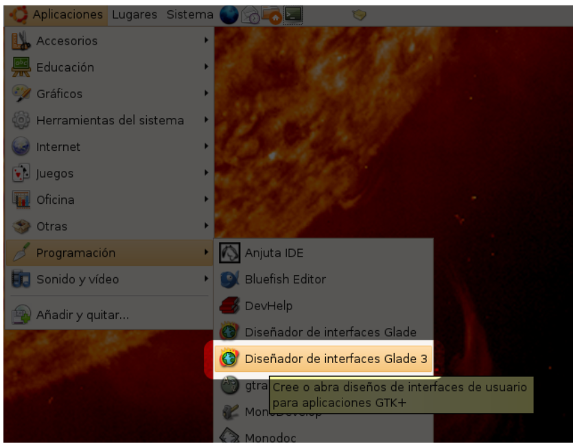

Al iniciar la aplicación, aparecerán tres ventanas: La ventana de proyecto de Glade, la paleta de
**widgets*** y la ventana de propiedades. Vea la Figura 4.1.2.

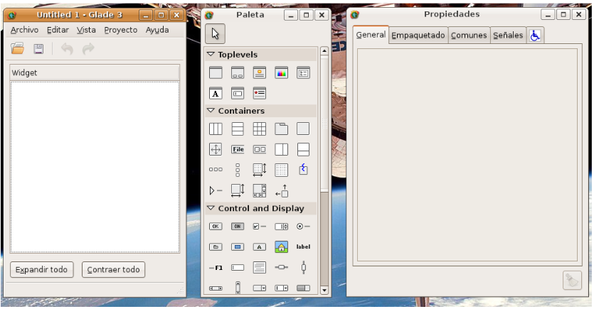

La ventana principal esta compuesta por la barra de menús, la barra de herramientas y una sección en blanco que contendrá una representación de la estructura de la aplicación. Los últimos dos botones permitirán controlar la manera en que se visualiza la representación de la estructura de nuestra aplicación.

La paleta contiene colecciones de **widgets** agrupados en las siguientes categorias:

* Toplevels - Contiene ventanas y cuadros de dialogo.
* Containers - Contenedores de todo tipo, como cajas y tablas.
* Control and Display – **Widgets** de control y despliegue de datos como
  botones, etiquetas y entradas de texto.
* GTK+ Obsolete – Este grupo contiene **widgets** que han sido reemplazados por
  otros mas flexibles u otros que son de uso muy poco común, como GtkCurve.
* GNOME User Interface – **Widgets** diseñados para ser usados con el entorno GNOME.
* GNOME UI Obsolete – **Widgets** diseñados para usarse con el entorno GNOME pero que han
sido reemplazados con otros más flexibles o ya son de uso poco común. Algunos **widgets** ya
han sido implementados directamente en GTK+.
* GNOME Canvas – **Widgets** de dibujo, especialmente diseñados para aplicaciones con dibujos
vectoriales o elementos gráficos interactivos.

La ventana de propiedades contiene cinco pestañas, cada una mostrando información de
configuración para cada **widget**.

* General - En esta pestaña se ajustan propiedades generales de un **widget**
  como su nombre o el ancho de borde.
* Empaquetado - En esta pestaña se encuentran los ajustes para aquellos
  **widget**s que se encuentren insertos en en contenedor (Consulte el capitulo
  3.5 para una referencia completa del sistema de empaquetado de GTK+).
* Comunes - Esta pestaña muestra una colección de propiedades ajustables de cualquier **widget**.
Estas operaciones tienen como contra parte algún método de la clase GtkWidget.
* Señales - Esta es una lista, agrupada por clase, de todas las señales que puede atrapar un *widget*.
A la izquierda se muestra el nombre de la señal y a la derecha el nombre de la función
retrollamada.
* Tecnología de asistencia - GTK+ toma en cuenta a las personas con capacidades diferentes. En
esta pestaña permite añadir soporte de tecnología de asistencia a una aplicación de GTK+.

Una vez que hemos revisado de manera general Glade3 podemos comenzar un proyecto.

Trabajando con un proyecto
==========================

A manera de comparación, recrearemos el ejemplo visto en la sección 3.8.

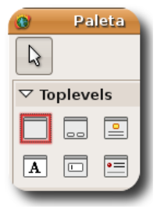

1. En el grupo Toplevels de la paleta, presione en el primer icono. Una ventana aparecerá con un fondo gris: Glade3 acaba de crear una instancia de GtkWindow para usted.
También note que en la ventana principal de Glade3 ha aparecido la representación de la
instancia de GtkWindow que acaba de ser creada.

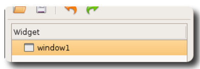

2. El siguiente paso es insertar una etiqueta. El icono se encuentra en el grupo "Control and
Display" de la paleta. Haga **click** en el icono y visualice la ventana que se acaba de crear.
Cuando el cursor del ratón circula por el área gris de la ventana, el puntero del ratón cambia por una cruz. Haga **click** en cualquier área gris de la ventana. El área gris desaparecerá y en su lugar aparecerá una instancia de GtkLabel (ver Figura 4.2.3).

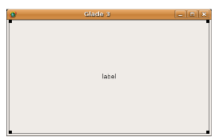

3. Observe que la ventana principal de Glade3 ha actualizado la representación de la aplicación
que estamos diseñando. Se ha vuelto un árbol de donde se desprenden los widgets hijos de cada
ventana de nivel superior (ver Figura 4.2.4).

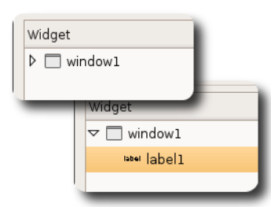

4. Haciendo **click** en cualquier elemento de la representación provoca que ese widget obtenga el
foco; cuando un widget obtiene el foco es posible configurarlo usando la ventana de propiedades.

Haga **click** en el elemento que representa la instancia de GtkWindow.

5. Centre ahora su atención en la ventana de propiedades (ver Figura 4.2.5); ahí puede cambiar el nombre de la instancia de GtkWindow, que en este ejemplo se llamará ventana.

6. Cambie el título de la ventana a "glade1.c". Esto equivale a llamar al método
gtk_window_set_title().

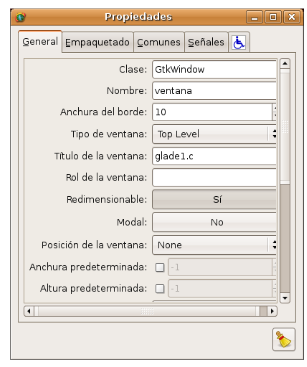

7. Seleccione la pestaña "Señales" y busque la señal "delete-event" dentro del grupo de
señales pertenecientes a GtkWidget.

8. Haga doble **click** en la columna de la derecha y escriba "gtk_main_quit". Esto conectará la
señal "delete-event" de la instancia de GtkWindow con la retrollamada
gtk_main_quit().

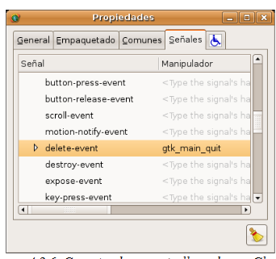

9. En la pestaña Comunes, de la ventana de propiedades establezca la petición de anchura en 260
y la petición de altura en 60. Esto equivale a usar el método
gtk_widget_set_size_request().

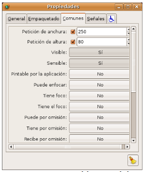

10. Dentro de la misma pestaña asegúrese que la propiedad visible este ajustada a Si. Esta
propiedad instruye a libglade a que llame el método gtk_widget_show() para el **widget**
que se esta configurando.

11. Seleccione ahora la etiqueta y cambie el texto a "INSTITUTO TECNOLÓGICO DE
PUEBLA". Ajuste la propiedad visible a Si.

El ejemplo está preparado ahora. Guarde el ejemplo con el nombre "glade1.glade" y prosiga
con la siguiente sección para aprender el uso de la librería libglade.

Introducción a libglade
=======================

Libglade es la librería de soporte de Glade3. Permite construir y modificar la estructura de
una GUI mediante un archivo XML Esta forma de programación de interfases gráficas de usuario
permite la separación del código del programa del código de la interfaz gráfica.
El tiempo de ejecución de la librería ha sido optimizado para ser extremadamente rápida. Una vez que la aplicación ha sido construida, esta funcionará a su máxima velocidad pues libglade esta implementada en el lenguaje C.

Proceso de creación de una aplicación con libglade
===================================================

El uso de libglade en nuestras aplicaciones permite la separación de la parte lógica de la aplicación de la parte gráfica. Lo anterior quiere decir que nosotros dibujaremos la aplicación a nuestro gusto usando Glade3 y posteriormente escribiremos la lógica de comportamiento de la aplicación en cualquier lenguaje como Python o C. Una vez guardada la descripción de la GUI en un archivo XML el proceso para reconstruir la GUI se muestra a continuación.

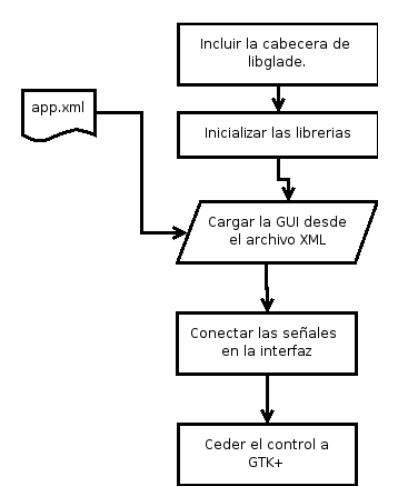

Del manual de referencia de libglade copiamos un programa básico de libglade en C.

(Listado de Programa 4.3.1)     

.. code-block:: c

    /***************************************************************************
    * Programacion de interfases graficas de usuario con GTK
    *  
    *  Nombre de archivo:      
    *  Descripcion:            Ejemplo de una aplicación básica con libglade.
    *  Widgets usados:         
    *  Comentarios:            Ejemplo tomado del manual de referencia de
    *                          libglade
    *
    *  TESIS PROFESIONAL       INSTITUTO TECNOLOGICO DE PUEBLA
    *                          INGENIERIA ELECTRONICA
    *  Fuente: Manual de referencia de libglade versión 2.5.0
    *
    ****************************************************************************/
    #include <gtk/gtk.h>
    /*Incluir la cabecera de libglade*/
    #include <glade/glade.h>
    void func_retrollamada(GtkWidget *widget, gpointer datos_extra) {
    /* Hacer algo util aqui */
    }

    Figura 4.3.1: Proceso de creación de una GUI con 
    libglade.
    int main(int argc, char *argv[]) {
        /* Este es un puntero a un objeto de tipo GladeXML*/
        GladeXML *xml;
        /*Inicializar las librerias*/
        gtk_init(&argc, &argv);
        /* cargar la GUI desde el archivo XML */
        xml = glade_xml_new("app.xml", NULL, NULL);
        /* Conectar las señales en la GUI */
        glade_xml_signal_autoconnect(xml);
        /* Ceder  el control a GTK+*/
        gtk_main();
        return 0;
    }

La notable simplicidad de libglade es donde radica su capacidad. Si compiláramos el ejemplo
anterior tendríamos la posibilidad de construir aplicaciones muy sencillas como una ventana con un botón hasta aplicaciones complejas como un editor de texto. Lo único que tendríamos que hacer es intercambiar la descripción XML de la GUI y liblgade hará el trabajo por nosotros.
Aunque libglade nos libera de las tareas tediosas de crear GUIs usando el API de GTK+, aún
así debemos conocer la manera de cómo interactuar con la interfaz gráfica generada: tenemos que crear retrollamadas e interactuar con el usuario.

Constructor de clase
====================

La librería libglade utiliza el estilo de programación de GTK+ y GNOME, así que podremos
seguir aplicando la metodología aprendida hasta ahora.

La construcción e interacción con una GUI creada con libglade se hace mediante el objeto
GladeXML. Ya que libglade se implementa usando el modelo de GTK+ y Glib, podemos esperar
un funcionamiento similar a los **widgets** de GTK+.

El objeto GladeXML representa una instancia de la GUI creada a partir de una descripción en
formato XML. Cuando se crea una instancia de la clase GladeXML, la descripción se lee desde un
archivo y se crea la GUI.

Una vez instanciada la clase GaldeXML, esta provee una serie de útiles métodos para acceder a
los **widgets** de la GUI por medio de una referencia o nombre dentro de la descripción XML.
La clase GladeXML también provee métodos para conectar cualquier retrollamada que haya sido
asociada con alguna señal o evento dentro de la descripción XML.

Por último, libglade provee métodos que buscan nombres de manejadores de señal en la tabla
de símbolos de la aplicación y automáticamente conectar tantas retrollamadas como pueda.

.. code-block:: c

    GladeXML* glade_xml_new (const char *fname,
    const char *root,
    const char *domain);        

**Descripción**: Crea una nueva instancia del objeto GladeXML a partir de un archivo de
descripción en formato XML. Opcionalmente se puede comenzar a construir la interfaz a partir de un widget. Es útil si se desea construir solamente una barra de menú y no toda la aplicación en la que esta contenida. La descripción en XML se cachea para acelerar futuras operaciones.

**Parámetros**:

* **fname** : Nombre del archivo que contiene la descripción XML de la GUI.
* **root** : El nodo desde donde se desea comenzar a construir. NULL si desea construir.
* **domain** : Dominio de transición XML.

**Valor de retorno**: Una nueva instancia de la clase GladeXML que describe una interfaz gráfica
de usuario. Regresa NULL si la operación ha fallado.

Métodos de clase
================

.. code-block:: c

    GtkWidget* glade_xml_get_widget (GladeXML *self,
    const char *name);         

**Descripción**: Regresa el puntero del widget con el nombre especificado. Esta función permite el
acceso a componentes individuales de una GUI después de que ha sido construida.

**Parámetros**:

* **self** : Una instancia de GladeXML.
* **name** : El nombre del widget.

**Valor de retorno**: El puntero del widget cuyo nombre coincida con el especificado. Regresa
NULL si el widget no existe.

.. code-block:: c

    void glade_xml_signal_connect (GladeXML *self,
    const char *handlername,
    GCallback func);        

**Descripción**: Dentro de la descripción XML de una GUI, las funciones retrollamada se especifican
usando el nombre de la función y no un puntero a ella. Esta función permite conectar una función a todas aquellas señales que hayan especificado esta función como función retrollamada.

**Parámetros**:

* **self**: Una instancia de GladeXML.
* **handlername**: El nombre de la función retrollamada.
* **func**: Un puntero a la función retrollamada. Use la macro G_CALLBACK()
  para moldear el puntero de la función al tipo adecuado.

.. code-block:: c

    void glade_xml_signal_connect_data (GladeXML *self,
    const char *handlername,
    GCallback func,
    gpointer user_data);     

**Descripción**: La diferencia entre este método y glade_xml_signal_connect() es que esta
permite pasar el parámetro extra que se acostumbra en g_signal_connect().

**Parámetros**:

* **self** : Una instancia de GladeXML.
* **handlername** : El nombre de la función retrollamada.
* **handlername** : Un puntero a la función retrollamada. Use la macro
  G_CALLBACK() para moldear el puntero de la función al tipo adecuado.
* **user_data** : Datos extra que se pasarán a la función retrollamada.

.. code-block:: c

    void glade_xml_signal_autoconnect (GladeXML *self);   

**Descripción**: Este método permite conectar automáticamente todas las retrollamadas que hayan
sido descritas en la descripción XML de la GUI.

**Parámetros**:

* **self** : Una instancia de GladeXML.

.. note:: 

    Nota: glade_xml_signal_autoconnect() usa la tabla de símbolos de la aplicación para tratar de encontrar las funciones retrollamadas. Si desea auto conectar retrollamadas que se hayan declarado y definido en el ejecutable principal de la aplicación (main.c para muchos casos), será necesario pasar alguna directiva al enlazador de la aplicación para que también exporte los símbolos de la aplicación principal. Para un entorno de desarrollo GNU se debe agregar la directiva -export-dynamic a la orden de compilación. Los Makefiles de los ejemplos
    incluidos en este documento ya están preparados para compilar adecuadamente.

Ejemplos.
---------

Ejemplo 1 – Ciclo de vida de una aplicación con libglade
========================================================

En este primer ejemplo mostraremos el ciclo de vida de una aplicación con libglade. Se construirán dos interfases diferentes y mostraremos que con sólo cambiar el archivo XML podremos cambiar completamente la GUI sin cambiar una sola línea de código.
La primera GUI se retomará del ejemplo que se construyó en los capítulos 4.3 y 4.3.1: Una
ventana con una etiqueta adentro.

La segunda GUI será una ventana con un botón adentro. Con respecto a esta última debemos de
asegurarnos que:

* La instancia de la ventana deberá conectar la señal "delete-event" con el
  método delete_event() de GTK+.
* La instancia del botón deberá conectar la señal **clicked** con el método
  retrollamada() que proveerá nuestra aplicación (ver Figura 4.6.1).
* Que tanto la ventana como el botón tengan activada la propiedad visible (en la
  pestaña Comunes de la ventana de propiedades).
* El botón deberá tener un ancho de 260 **pixeles** y una altura de 60
  **pixeles** (en la pestaña Comunes de la ventana de propiedades).
* La ventana deberá un ancho de borde de 10 **pixeles** (en la pestaña Generales
  de la ventana de propiedades).
* Guarde el archivo XML como glade2.xml.

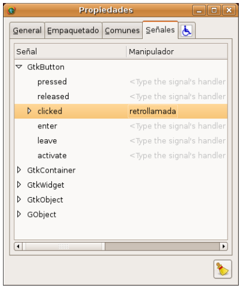

El código fuente de la aplicación estará basado en el mostrado en los capítulos 4.3 y 4.3.1.

(Listado de Programa 4.6.1)     

.. code-block:: c

    /***************************************************************************
    *   Programacion de interfases graficas de usuario con GTK
    *
    * Nombre de archivo:       glade1.c
    * Descripcion:             Ejemplo del ciclo de vida de una aplicación
    *                          con libglade.
    * Widgets usados:          GtkWidget
    * Objetos usados:          GladeXML
    * Comentarios:             Ejemplo basado del manual de referencia de
    *                          libglade
    *
    * TESIS PROFESIONAL        INSTITUTO TECNOLOGICO DE PUEBLA
    *                          INGENIERIA ELECTRONICA
    * Fuente: Manual de referencia de libglade versión 2.5.0
    *
    ****************************************************************************/
    #include <gtk/gtk.h>
    /*Incluir la cabecera de libglade*/
    #include <glade/glade.h>
    /*Incluir stdlib para usar la función exit()*/
    #include <stdlib.h>
    void retrollamada(GtkWidget *widget, gpointer datos_extra) {
    g_print("Funcion retrollamada\n");
    }
    int main(int argc, char *argv[]) {
        GladeXML *xml;
    //GtkWidget *ventana;
    /* Inicializar la libreria GTK */
    gtk_init (&argc, &argv);
    if (!argv[1]){
    g_print("Especifique la GUI que se debera construir\n");
    exit(1);
    }
    g_print("Construyendo GUI del archivo %s\n",argv[1]);
        /* cargar la GUI desde el archivo XML */
        xml = glade_xml_new(argv[1], NULL, NULL);
    //ventana =  glade_xml_get_widget(xml,"ventana");
        /* Conectar las señales en la GUI */
        glade_xml_signal_autoconnect(xml);
    //gtk_widget_show_all(ventana);
        /* Ceder el control a GTK+*/
        gtk_main();
        return 0;
    }

Este ejemplo, aunque es una GUI, debe de llamarse desde la línea de comandos y requiere de un
parámetro para funcionar: el nombre del archivo XML que contiene la descripción de la GUI. En este caso puede ser glade1.xml o glade2.xml. En caso de que no se le suministre ningún nombre de archivo el programa imprimirá un mensaje informativo y terminará inmediatamente.

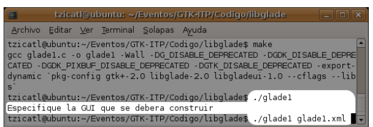

La GUI que se muestra en la Figura 4.6.3 ha sido llamada mediante el siguiente comando:

.. code-block:: c

    ./glade1 glade1.xml   

La GUI que se muestra en la Figura 4.6.4 ha sido llamada mediante este otro comando.

.. code-block:: c

    ./glade1 glade1.xml    

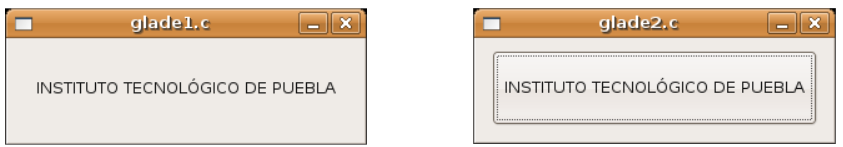

  
Ambas ventanas se cierran automáticamente pulsando el botón de cerrar. La segunda aplicación
imprime un mensaje en la consola cuando se presiona el botón.

Se ha demostrado que con el mismo código se pueden construir dos interfases diferentes usando
libglade. Se ha demostrado, también, como conectar señales automáticamente usando libglade.
Por último se ha demostrado el ciclo de vida básico de una aplicación que usa libglade

Bibliografía
-------------
[1] "X Window System". .Wikipedia, The Free Encyclopedia. Disponible al 1 Enero 2006 en la URL
http://en.wikipedia.org/wiki/X_Window_System
[2] "Windows GDI". .Microsoft Corporation. Disponible al 1 de Enero de 2006 en la URL
http://msdn.microsoft.com/library/default.asp?url=
[3] "Quartz Extreme, Faster graphics". . Apple Computer, Inc.. Disponible al 1 de Enero de 2006 en
la URL http://www.apple.com/macosx/features/quartzextreme
[4] "The Pango connection, ( 01 Mar 2001)". Tony Graham.IBM Corporation. Disponible al 1 de
Enero de 2006 en la URL http://www-128.ibm.com/developerworks/library/l-u-
[5] Brian Kernighan, Dennis Ritchie, The C Programming Languaje (Second Edition), 1988
[6]Noe Nieto, Christian Alarcon, Sotero I. Fuentes, Micro Laboratorio Virtual, 2004
[7] "Linked List Basics". Nick Parlante.Stanford CS Education Library. Disponible al en la URL
[8] "GNOME Programming Guidelines". Federico Mena Quintero, Miguel de Icaza. Morten
Welinder.. Disponible al 2 de Febrero de 2006 en la URL
http://developer.gnome.org/doc/guides/programming-guidelines/book1.html
